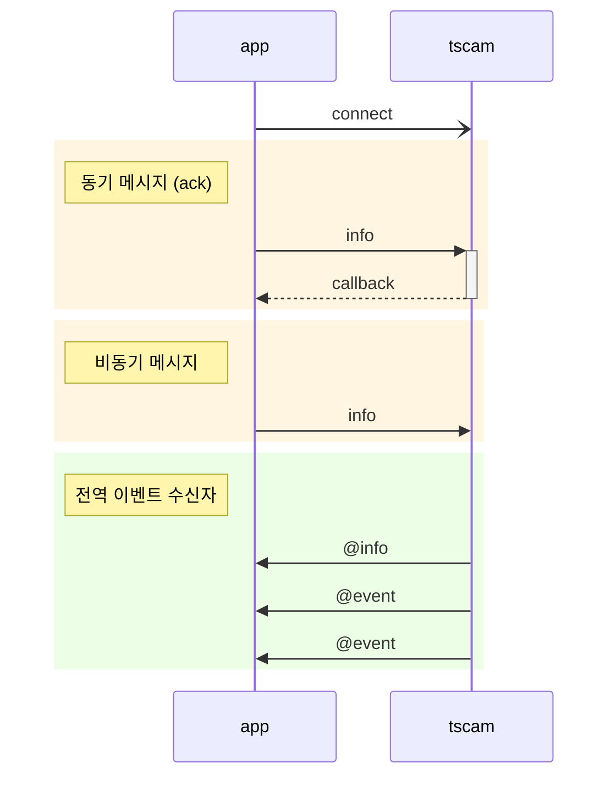
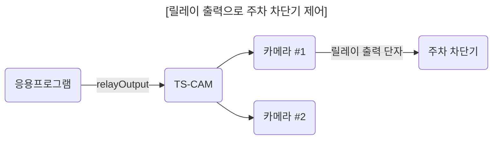
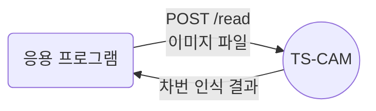

# 응용 프로그램 개발 가이드

## 목차
  - [개요](#개요)
  - [메시지](#메시지)
    - [1. `discover` 카메라 탐색](#1-discover-카메라-탐색)
    - [2. `info` 카메라 정보](#2-info-카메라-정보)
    - [3. `snapshot` 스냅샷 이미지](#3-snapshot-스냅샷-이미지)
    - [4. `relayOutput` 릴레이 출력](#4-relayoutput-릴레이-출력)
    - [5. `watchEvents` 이벤트 수신 대기](#5-watchevents-이벤트-수신-대기)
    - [6. `unwatchEvents` 이벤트 수신 종료](#6-unwatchevents-이벤트-수신-종료)
    - [7. `watchList` 이벤트 수신 대기 목록](#7-watchlist-이벤트-수신-대기-목록)
    - [8. `@event` 이벤트](#8-event-이벤트)
  - [차번 인식 API](#차번-인식-api)
## 개요

`TS-CAM` API는 Socket.IO 기반 실시간 메시지 전송방식으로 통신합니다.
API는 요청과 응답 데이터로에 `JSON`을 사용합니다.
동기(`ack`) 방식을 사용하면 요청에 대한 응답이 callback 함수로 호출되므로 요청과 응답을 한 쌍으로 구성하기 편리합니다.

반대로 비동기 방식이나 카메라에서 이벤트를 송신하는 경우는 응용 프로그램의 전역 이벤트 수신자를 통해 수신됩니다. 이 경우는 `TS-CAM`에서 응용 프로그램 방향으로 역방향 메시지를 의미하는 `@`문자를 메시지 앞에 붙여 구분합니다.



## 메시지

#### 1. `discover` 카메라 탐색

내부망에 연결된 ONVIF 호환 카메라 목록을 요청합니다.

  - 요청 매개변수
    ```jsx
    {
      "timeout": 1500,        // 카메라가 응답할 때까지 기다리는 시간 (밀리초)
      "device": "Ethernet"    // 네트워크 장치 (생략하면 시스템 기본값으로 동작)
    }
    ```
    - `device`에 사용할 수 있는 네트워크 장치 이름들은 아래와 같습니다.
        - Windows: `Ethernet` 또는 `Wi-Fi`
        - Linux: `eth0`, `enp0s3`, `wlan0`

  - 응답 데이터
    - 응답 데이터 내용 중 각 카메라 정보는 로그인하지 않은 상태로 얻을 수 있는 기본 정보이며 제조사마다 일부 항목이 없는 경우도 있습니다.
    - `href`는 필수 항목이며, 이후 메시지에서 카메라를 지칭하는 키 값으로 사용됩니다.
    ```jsx
    {
      "result": true,   // 처리 결과
      "devices": [      // 탐색된 카메라 목록
        {
          "name": "DCC-1M0",
          "type": "NetworkVideoTransmitter",
          "hardware": "DCC-1M0",
          "Profile": [
            "Streaming"
          ],
          "href": "http://192.168.0.30/onvif/device_service"
        },
        {
          "name": "SNP-6320RH",
          "manufacturer": "Hanwha Techwin",          
          "type": "ptz",
          "hardware": "SNP-6320RH",
          "Profile": [
            "Streaming"
          ],
          "href": "http://192.168.0.195:8000/onvif/device_service"
        },
        {
          "name": "Dahua",
          "type": "Network_Video_Transmitter",
          "hardware": "IPC-HFW2231R-ZS-IRE6",
          "Profile": [
            "Streaming"
          ],
          "href": "http://192.168.0.203/onvif/device_service"
        },

        // ... 생략
      ]
    }
    ```

#### 2. `info` 카메라 정보
로그인을 통해 카메라 상세 정보를 얻습니다.
로그인 상태가 유지되지 않으므로 요청할 때마다 `username`과 `password`를 전달해야 합니다.

  - 요청 매개변수  
    ```jsx
    {
      "href": "http://192.168.0.30/onvif/device_service", // 대상 카메라
      "alias": "주차장입구",  // 이름 지정
      "username": "admin",   // 카메라 로그인 아이디
      "password": "admin",   // 카메라 로그인 비밀번호
      "authType": "basic"    // 인증 방식
    }
    ```
      - `alias`: 카메라에 이름을 부여하면 응답데이터에 붙어옵니다.
      - `authType`: `basic`, `digest` 중 카메라가 지원하는 인증 방식으로 지정합니다. 생략하면   기본값으로 `basic`이 적용됩니다.
  
  - 응답 데이터
      - `info` 항목의 내용은 카메라 제조사와 사양에 따라 다르게 표시됩니다.
      **[중요] 이 중에서 `inputPorts`와 `outputPorts`가 각각 1개 이상 있어야 루프센서 입력과   차단기 제어용 릴레이 출력으로 연결하여 사용할 수 있습니다.**
    ```jsx
    {
      "href": "http://192.168.0.30/onvif/device_service",
      "alias": "주차장입구",
      "result": true,         // 처리 결과
      "info": {
        "manufacturer": "PARANTEK",
        "model": "DCC-1M0",
        "firmwareVersion": "PT_FW_0027",
        "serialNumber": "645C:F3:50:19FD",
        "hardwareId": "PT_HW_DCC_1M0",
        "inputPorts": 2,      // 입력 단자 수 
        "outputPorts": 1      // 출력 단자 수
      }
    }
    ```

#### 3. `snapshot` 스냅샷 이미지
카메라에 스냅샷 이미지를 요청합니다.
스냅샷 이미지를 불러오면 이미지 파일 저장, 웹 이미지 링크를 기본 지원하며 차량번호인식을 수행하도록 설정할 수 있습니다.

  - 요청 매개변수
    ```jsx
    {
      "href": "http://192.168.0.30/onvif/device_service", // 대상 카메라
      "alias": "주차장입구",  // 이름 지정
      "username": "admin",   // 카메라 로그인 아이디
      "password": "admin",   // 카메라 로그인 비밀번호
      "authType": "basic",   // 인증 방식
      "anprOptions": "v"     // TS-ANPR 차량 번호인식 옵션
    }
    ```
    - `alias`: 카메라에 이름을 부여하면 이미지 파일명과 저장 디렉토리명에 적용됩니다.
      이미지 저장 경로는 다음과 같이 구성됩니다.
      ```js
      ${TSCAM_DATA_DIR}/${YYYYMMDD}/${alias}/${alias}-${YYYYMMDD}-${hhmmss.SSS}_$lateNo}.jpg
      // ${TSCAM_DATA_DIR} 환경변수에 설정한 디렉토리
      // ${YYYYMMDD} 년월일 8자리
      // ${alias} 요청 매개변수에 지정한 이름
      // ${hhmmss.SSS} 시분초.밀리초 10자리
      // ${plateNo} 차량 번호
      ```
    - `anprOptions`: 차량번호 인식 엔진에 전달되는 [options](https://github.com/bobhyun/TS-ANPR/blob/main/DevGuide.md#12-anpr_read_file) 항목 (`v,m,s,d,r`)입니다.
       옵션 문자를 사용하지 않고 번호인식하려면 `"anprOptions": ""` 이렇게 설정하고,
       만약 차량 번호인식 기능을 사용하지 않으려면 `anprOptions` 항목을 생략하면 됩니다.
    
  - 응답 데이터
    ```jsx
    {
      "href": "http://192.168.0.30/onvif/device_service",
      "alias": "주차장입구",
      "result": true,
      "anpr": [       // anprOptions을 사용한 경우 차량 번호인식 결과가 됨
        {
          "area": {
            "angle": 0.93,
            "height": 60,
            "width": 192,
            "x": 1038,
            "y": 522
          },
          "attrs": {
            "ev": false
          },
          "conf": {
            "ocr": 0.9533,
            "plate": 0.8595
          },
          "elapsed": 0.02,
          "ev": false,
          "text": "864고2097"
        }
      ],
      "snapshot": {
        "timestamp": "2024-08-12T11:31:31.027+09:00", // 이미지 생성 일시 SO 8601 형식)
        "filePath": "C:\\Program Data\\TS-Solution\\TS-CAM\\data\\20240812\\주차장입구\\주차장입구-20240812-113131.027_864고2097.jpg", // 이미지 저장 경로
        "uri": "http://127.0.0.1:10000/data/20240812/  C%A3%BC%EC%B0%A8%EC%9E%A5%EC%9E%85%EA%B5%AC/  C%A3%BC%EC%B0%A8%EC%9E%A5%EC%9E%85%EA%B5%AC-20240812-113131.027_864%EA%B3%A02097.jpg" // 이미지 링크
      }
    }
    ```

#### 4. `relayOutput` 릴레이 출력
릴레이 출력을 제어합니다.
릴레이 출력은 한 번에 한 카메라를 대상으로 하므로 최대 카메라 수 같은 라이선스 제한은 없습니다.



- 요청 매개변수
  ```jsx
  {
    "href": "http://192.168.0.30/onvif/device_service", // 대상 카메라
    "alias": "주차장입구",  // 이름 지정
    "username": "admin",   // 카메라 로그인 아이디
    "password": "admin",   // 카메라 로그인 비밀번호
    "authType": "basic",   // 인증 방식
    "portNo": 0,           // 릴레이 출력 단자 번호
    "value": 1             // 출력 값
  }
  ```
  - `portNo`: 포트번호는 0부터 시작하는 숫자이며 지정하지 않으면 0으로 간주합니다.
  - `value`: 0 (`off`) 또는 1 (`on`), 1값을 출력한 후 카메라가 자체적으로 잠시 후 0을 출력하도록 설정된 경우는 응용프로그램에서 0값을 출력해도 의미가 없을 수 있습니다.

- 응답 데이터
  ```jsx
  {
    "href": "http://192.168.0.30/onvif/device_service",
    "alias": "주차장입구",
    "result": true,
    "message": "Relay output value for port 0 successfully set to 1."
  }
  ```

#### 5. `watchEvents` 이벤트 수신 대기
카메라에서 트리거 입력(디지털 입력)이 발생하면 이벤트가 수신되도록 설정합니다.
이벤트 수신 대기는 아래 그림처럼 여러 대의 카메라에서 동시에 수신할 수 있는 기능입니다.
동시에 수신 대기할 수 있는 최대 카메라 수는 `TS-ANPR` 라이선스에 준합니다.

```mermaid
---
title: "[동시에 여러 카메라를 이벤트 수신 대기하는 구성]"
---
flowchart LR

cam1(Camera #1)-->tscam("TS-CAM</br>(watchEvent)")
cam2(Camera #2)-->tscam
cam3("Camera #3</br>입력단자가 두 개")-->tscam
tscam==>|@event|app(응용프로그램)
loop1(루프코일 #1)-->|Digital input 0|cam1
loop2(루프코일 #2)-->|Digital input 0|cam2
loop3(루프코일 #3)-->|Digital input 0|cam3
loop4(루프코일 #4)-->|Digital input 1|cam3
```
<br/>

  - 요청 매개변수
    `watchEvents` 요청은 여러 개의 카메라를 표현할 수 있도록 배열을 사용합니다.
    이벤트가 발생하면 스냅샷 이미지를 받고 차량 번호 인식하는 일련의 과정을 `TS-CAM`에서 수행하도록 지정할 수 있습니다.
    ```jsx
    [
        {
        "href": "http://192.168.0.30/onvif/device_service", // 대상 카메라
        "alias": "주차장입구",  // 이름 지정
        "username": "admin",   // 카메라 로그인 아이디
        "password": "admin",   // 카메라 로그인 비밀번호
        "authType": "basic",   // 인증 방식
        "anprOptions": "v"     // TS-ANPR 차량 번호인식 옵션
        },
        {
        "href": "http://192.168.0.31/onvif/device_service", // 대상 카메라
        "alias": "주차장출구",  // 이름 지정
        "username": "admin",   // 카메라 로그인 아이디
        "password": "admin",   // 카메라 로그인 비밀번호
        "authType": "basic",   // 인증 방식
        "snapshot": true       // TS-ANPR 차량 번호인식 옵션
        },

        // ... 생략
    ]
    ```
  - `anprOptions`: 이벤트가 발생하면 스냅샷 이미지를 받아 차량 번호인식한 결과를 수신하도록 지정합니다.
  - `snapshot`: 이벤트가 발생하면 스냅샷 이미지를 받아옵니다.
  `anprOptions`, `snapshot` 둘 다 설정하지 않으면 이벤트 입력 데이터만 받습니다.

  - 응답 데이터
    응답 데이터의 내용 중 `watchList`에 이벤트 수신 대기하는 대상 카메라의 응답이 포함됩니다. 각 카메라의 `result`가 `true`이면 정상적으로 이벤트 수신대기 상태로 설정된 것입니다.
    ```jsx
    {
        "result": true, // 처리 결과
        "watchList": [
        {
            "href": "http://192.168.0.30/onvif/device_service",
            "alias": "주차장입구",
            "result": true, // 카메라 응답
            "message": "Successfully subscribed to the events"
        },
        {
            "href": "http://192.168.0.31/onvif/device_service",
            "alias": "주차장출구",
            "result": true, // 카메라 응답
            "message": "Successfully subscribed to the events"
        },
        
        // ... 생략
        ]
    }
    ```

#### 6. `unwatchEvents` 이벤트 수신 종료
이벤트 수신 대기를 종료합니다.

  - 요청 매개변수
    수신대기를 종료하고자 하는 카메라 목록을 배열로 구성합니다.
    ```jsx
    [
        {
        "href": "http://192.168.0.30/onvif/device_service", // 대상 카메라
        "alias": "주차장입구",  // 이름 지정
        "username": "admin",   // 카메라 로그인 아이디
        "password": "admin",   // 카메라 로그인 비밀번호
        "authType": "basic"    // 인증 방식
        }

        // ... 생략
    ]
    ```

  - 응답 데이터
    ```jsx
    {
      "result": true,
      "unwatchList": [
        {
          "href": "http://192.168.0.30/onvif/device_service",
          "alias": "주차장입구",
          "result": true,
          "message": "Successfully unsubscribed from the events"
        },

        // ... 생략
      ]
    }
    ```

#### 7. `watchList` 이벤트 수신 대기 목록
`watchEvents`, `unwatchEvents` 요청은 한 번에 할 수도 있지만 여러 번 나누어 요청할 수도 있습니다.
따라서 현재 어떤 카메라들이 이벤트 수신 대기 상태인지 확인하기 위해 이 `watchList` 요청을 사용합니다.

  - 요청 매개변수
    매개변수는 없으므로 `null`을 매개변수 자리에 넣습니다.

  - 응답 데이터
    ```jsx
    {
      "result": true,
      "watchList": [
        {
          "href": "http://192.168.0.30/onvif/device_service",
          "alias": "주차장입구",
          "since": "2024-08-12T14:27:18.000+09:00"  // 수신대기 시작 일시
        },

        // ... 생략
      ]
    }
    ```

#### 8. `@event` 이벤트
이벤트 수신 대기 상태의 카메라에서 이벤트가 발생하면 `@event`를 수신합니다.
다른 메시지처럼 요청 및 응답 형태가 아니고 `TS-CAM`에서 응용 프로그램 방향으로 전송되므로 `@`문자를 붙어 역방향 메시지임을 명시합니다.

  - 이벤트 데이터
     `watchEvnets`호출시 `anprOptions`를 지정한 경우, 아래와 같이 스냅샷 이미지와 차량 번호인식 결과가 포함됩니다.
    ```jsx
    {
      "href": "http://192.168.0.30/onvif/device_service",
      "alias": "주차장입구",
      "events": [   // 동시에 여러 이벤트가 들어오는 경우를 위해 배열로 표기 
        {
          "timestamp": "2024-08-12T14:29:56.779+09:00",  // 이벤트 발생 일시
          "type": "digitalInput",  // 이벤트 종류 (디지털 입력)
          "portNo": 1,             // 디지털 입력 포트          
          "value": 1,              // 값
          "snapshot": {            // 스냅샷 이미지
            "timestamp": "2024-08-12T14:29:56.985+09:00",
            "filePath": "D:\\tmp\\tscam\\data\\20240812\\주차장입구\\주차장입구-20240812-142956.985_864고2097.jpg",
            "uri": "http://127.0.0.1:10000/OMG/20240812/%EC%A3%BC%EC%B0%A8%EC%9E%A5%EC%9E%85%EA%B5%AC/%EC%A3%BC%EC%B0%A8%EC%9E%A5%EC%9E%85%EA%B5%AC-20240812-142956.985_864%EA%B3%A02097.jpg"
          },
          "anpr": [                // 차량 번호인식 결과
            {
              "area": {
                "angle": 0.927,
                "height": 51,
                "width": 216,
                "x": 1011,
                "y": 525
              },
              "attrs": {
                "ev": false
              },
              "conf": {
                "ocr": 0.958,
                "plate": 0.8966
              },
              "elapsed": 0.0545,
              "ev": false,
              "text": "864고2097"
            }
          ]
        }
      ]
    }
    ```
    방문차량 번호를 판단해서 주차 차단기를 개방하는 기능을 구현하는 경우, `@event` 메시지 수신하면 포함된 `anpr.text`를 데이터베이스에서 조회하여 조건에 해당하는 차량 번호인 경우 `relayOutput` 요청을 보내서 차단기를 개방하는 방식으로 처리할 수 있습니다.

    참고로 응용프로그램 여러 개가 하나의 `TS-ANPR`에 접속된 경우, 이벤트가 발생하면 모든 응용 프로그램들에게 동시에 전파(`broadcasting`)하는 방식으로 `@event` 메시지를 송신합니다.
    
    ```mermaid
    ---
    title: "[동시에 여러 응용 프로그램이 접속된 경우 이벤트 전파]"
    ---
    flowchart LR

    loop1(루프코일 #1)-->|Digital input 0|cam1
    cam1(Camera #1)-->tscam("TS-CAM</br>(watchEvent)")
    tscam==>|@event|app1(응용프로그램 #1)
    tscam==>|@event|app2(응용프로그램 #2)
    tscam==>|@event|app3(응용프로그램 #3)
    tscam==>|@event|app4(응용프로그램 #4)
    app1-->|relayOutput|tscam
    app2-->|이미지 분석|app2
    app3-->|이미지 업로드|storage[(대용량 스토리지)]
    app4-->|API|결제
    app1<-->db[(데이터베이스)]
    ```

    이런 이벤트 전파 구조를 활용해서 위의 그림처럼 각 응용 프로그램의 기능을 나누어 마이크로서비스 형태로 구성할 수도 있습니다.

## 차번 인식 API
응용 프로그램 개발 편의를 위해 차량 번호인식 API를 제공합니다.
아래와 같이 `TS-CAM` 서버로 이미지 파일을 업로드하면 차번 인식 결과를 반환합니다.

서버 측에 업로드된 이미지는 차번 인식 후 메모리 버퍼에서 삭제되며 별도로 저장하지 않습니다.

- 엔드포인트: **POST /read**

- 파라미터:
  - `options`: [차번 인식 옵션 (`vmsdr`)](https://github.com/bobhyun/TS-ANPR/blob/main/DevGuide.md#12-anpr_read_file)

- 요청 본문:
  - `Content-Type: multipart/form-data`
  - `image`: 분석할 이미지 파일 (필수)

- 응답:
  - `200 OK`: 성공
    - 응답 본문:
      - `Content-Type: application/json`
      - 지정한 `options`에 따른 [차번 인식 결과](https://github.com/bobhyun/TS-ANPR/blob/main/DevGuide.md#213-json) 또는 [객체 인식 결과](https://github.com/bobhyun/TS-ANPR/blob/main/DevGuide.md#222-json)
  - `400 Bad Request`: 잘못된 요청
  - `500 Internal Server Error`: 서버 오류

- 예시
  - 요청
    ```http
    POST http://127.0.0.1/read?options=v
    Content-Type: multipart/form-data; boundary=----WebKitFormBoundary7MA4YWxkTrZu0gW

    ------WebKitFormBoundary7MA4YWxkTrZu0gW
    Content-Disposition: form-data; name="image"; filename="car.jpg"
    Content-Type: image/jpeg

    (이미지 파일의 바이너리 데이터)
    ------WebKitFormBoundary7MA4YWxkTrZu0gW--
    ```
  - 응답
    ```json
    HTTP/1.1 200 OK
    Content-Type: application/json

    [
      {
        "area": {
            "angle": 1.4943,
            "height": 63,
            "width": 200,
            "x": 1988,
            "y": 569
        },
        "attrs": {
            "ev": false
        },
        "conf": {
            "ocr": 0.9357,
            "plate": 0.8767
        },
        "elapsed": 0.0268,
        "ev": false,
        "text": "123가5678"
      }
    ]
    ```
