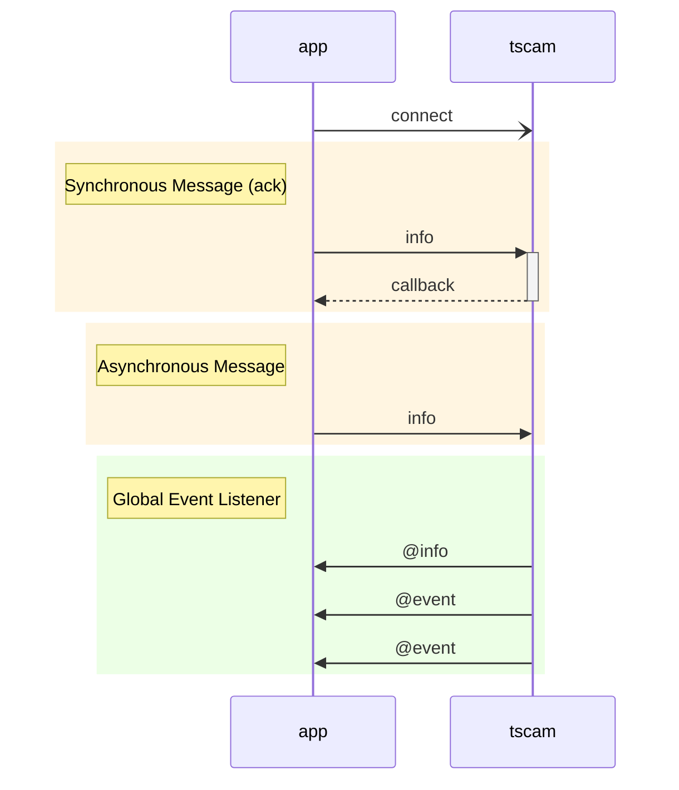
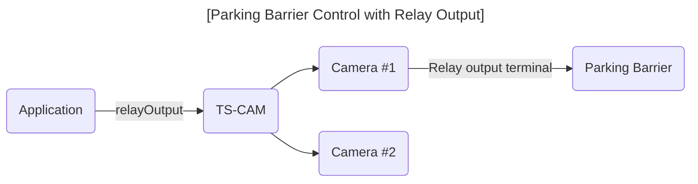
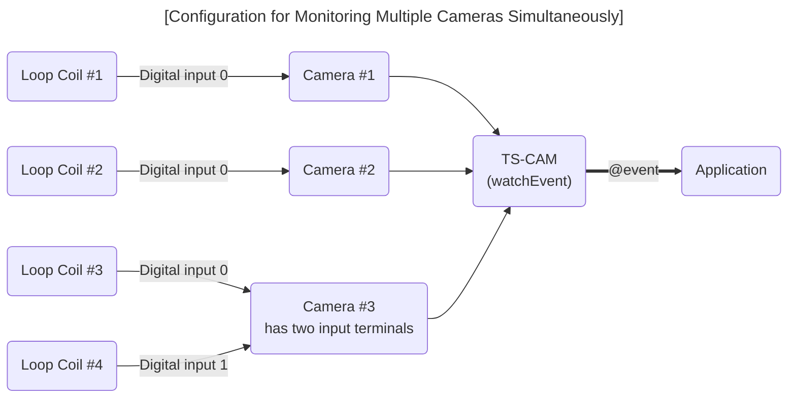
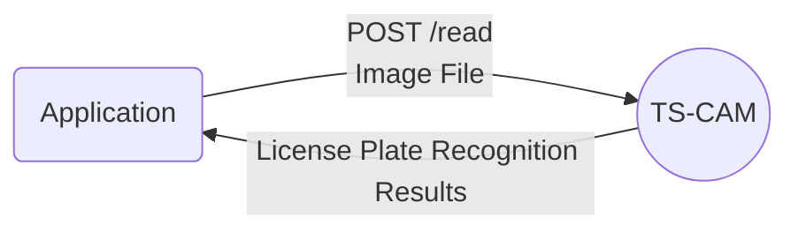

English | [한국어](doc.i18n/ko-KR/DevGuide.md) | [日本語](doc.i18n/ja-JP/DevGuide.md) | [Tiếng Việt](doc.i18n/vi-VN/DevGuide.md)

# Application Development Guide

## Table of Contents

- [Overview](#overview)
- [Messages](#messages)
  - [1. `discover` Camera Discovery](#1-discover-camera-discovery)
  - [2. `info` Camera Information](#2-info-camera-information)
  - [3. `snapshot` Snapshot Image](#3-snapshot-snapshot-image)
  - [4. `relayOutput` Relay Output](#4-relayoutput-relay-output)
  - [5. `watchEvents` Event Waiting](#5-watchevents-event-waiting)
  - [6. `unwatchEvents` Event Waiting Termination](#6-unwatchevents-event-waiting-termination)
  - [7. `watchList` Event Waiting List](#7-watchlist-event-waiting-list)
  - [8. `@event` Event](#8-event-event)
- [License Plate Recognition API](#license-plate-recognition-api)

## Overview

The `TS-CAM` API uses Socket.IO-based real-time message transmission for communication.
The API uses `JSON` for request and response data.
When using synchronous (`ack`) mode, the response to a request is called through a callback function, making it convenient to pair requests and responses.

Conversely, when using asynchronous mode or when the camera sends events, they are received through the application's global event listener. In this case, the `@` character is prefixed to the message to distinguish it as a reverse message from `TS-CAM` to the application.


```mermaid
sequenceDiagram
    participant app
    participant tscam

    app-)tscam: connect
    rect rgb(255, 245, 225)
    note left of app: Synchronous Message (ack)
    app->>+tscam: info
    tscam-->>-app: callback
    end


    rect rgb(255, 245, 225)
    note left of app: Asynchronous Message
    app->>tscam: info
    end

    rect rgb(236, 255, 230)
    note left of app: Global Event Listener
    tscam->>app: @info
    tscam->>app: @event
    tscam->>app: @event
    end
```

## Messages

#### 1. `discover` Camera Discovery

Requests a list of ONVIF-compatible cameras connected to the internal network.

- Request Parameters

  ```jsx
  {
    "timeout": 1500,        // Time to wait for camera response (milliseconds)
    "device": "Ethernet"    // Network device (uses system default if omitted)
  }
  ```

  - Available network device names for `device` include:
    - Windows: `Ethernet` or `Wi-Fi`
    - Linux: `eth0`, `enp0s3`, `wlan0`

- Response Data

  - The response data content includes basic information about each camera that can be obtained without logging in, and some items may be missing depending on the manufacturer.
  - `href` is a required field and is used as a key to reference the camera in subsequent messages.

  ```jsx
  {
    "result": true,   // Processing result
    "devices": [      // List of discovered cameras
      {
        "name": "DCC-1M0",
        "type": "NetworkVideoTransmitter",
        "hardware": "DCC-1M0",
        "Profile": [
          "Streaming"
        ],
        "href": "http://192.168.0.30/onvif/device_service"
      },
      {
        "name": "SNP-6320RH",
        "manufacturer": "Hanwha Techwin",
        "type": "ptz",
        "hardware": "SNP-6320RH",
        "Profile": [
          "Streaming"
        ],
        "href": "http://192.168.0.195:8000/onvif/device_service"
      },
      {
        "name": "Dahua",
        "type": "Network_Video_Transmitter",
        "hardware": "IPC-HFW2231R-ZS-IRE6",
        "Profile": [
          "Streaming"
        ],
        "href": "http://192.168.0.203/onvif/device_service"
      },

      // ... omitted
    ]
  }
  ```

#### 2. `info` Camera Information

Logs in to get detailed camera information.
Since the login state is not maintained, you need to pass `username` and `password` with each request.

- Request Parameters

  ```jsx
  {
    "href": "http://192.168.0.30/onvif/device_service", // Target camera
    "alias": "Parking Entrance",  // Name assignment
    "username": "admin",   // Camera login ID
    "password": "admin",   // Camera login password
    "authType": "basic"    // Authentication type
  }
  ```

  - `alias`: If you assign a name to the camera, it will be included in the response data.
  - `authType`: Specify the authentication method (`basic`, `digest`) supported by the camera. If omitted, `basic` is applied as the default value.

- Response Data
  - The content of the `info` item varies by camera manufacturer and specifications.
    **[Important] Among these, `inputPorts` and `outputPorts` must have at least one each to connect and use as loop sensor input and barrier control relay output.**
  ```jsx
  {
    "href": "http://192.168.0.30/onvif/device_service",
    "alias": "Parking Entrance",
    "result": true,         // Processing result
    "info": {
      "manufacturer": "PARANTEK",
      "model": "DCC-1M0",
      "firmwareVersion": "PT_FW_0027",
      "serialNumber": "645C:F3:50:19FD",
      "hardwareId": "PT_HW_DCC_1M0",
      "inputPorts": 2,      // Number of input terminals
      "outputPorts": 1      // Number of output terminals
    }
  }
  ```

#### 3. `snapshot` Snapshot Image

Requests a snapshot image from the camera.
When loading a snapshot image, it supports image file storage, web image links, and can be set to perform vehicle number recognition.

- Request Parameters

  ```jsx
  {
    "href": "http://192.168.0.30/onvif/device_service", // Target camera
    "alias": "Parking Entrance",  // Name assignment
    "username": "admin",   // Camera login ID
    "password": "admin",   // Camera login password
    "authType": "basic",   // Authentication type
    "anprOptions": "v"     // TS-ANPR vehicle number recognition options
  }
  ```

  - `alias`: If you name the camera, it will be applied to the image file name and storage directory name.
    The image storage path is structured as follows.
    ```js
    ${TSCAM_DATA_DIR}/${YYYYMMDD}/${alias}/${alias}-${YYYYMMDD}-${hhmmss.SSS}_$lateNo}.jpg
    // ${TSCAM_DATA_DIR} directory set in environment variable
    // ${YYYYMMDD} 8-digit year-month-day
    // ${alias} name specified in request parameters
    // ${hhmmss.SSS} 10-digit hour-minute-second.millisecond
    // ${plateNo} vehicle number
    ```
  - `anprOptions`: These are the [options](https://github.com/bobhyun/TS-ANPR/blob/main/DevGuide.md#12-anpr_read_file) (`v,m,s,d,r`) passed to the license plate recognition engine.
    If you want to perform number recognition without using option characters, set `"anprOptions": ""`,
    If you do not want to use the vehicle number recognition feature, you can omit the `anprOptions` item.

- Response Data
  ```jsx
  {
    "href": "http://192.168.0.30/onvif/device_service",
    "alias": "Parking Entrance",
    "result": true,
    "anpr": [       // License plate recognition results when using anprOptions
      {
        "area": {
          "angle": 0.93,
          "height": 60,
          "width": 192,
          "x": 1038,
          "y": 522
        },
        "attrs": {
          "ev": false
        },
        "conf": {
          "ocr": 0.9533,
          "plate": 0.8595
        },
        "elapsed": 0.02,
        "ev": false,
        "text": "864고2097"
      }
    ],
    "snapshot": {
      "timestamp": "2024-08-12T11:31:31.027+09:00", // Image creation time (ISO 8601 format)
      "filePath": "C:\\Program Data\\TS-Solution\\TS-CAM\\data\\20240812\\ParkingEntrance\\ParkingEntrance-20240812-113131.027_864고2097.jpg", // Image storage path
      "uri": "http://127.0.0.1:10000/data/20240812/ParkingEntrance/ParkingEntrance-20240812-113131.027_864고2097.jpg" // Image link
    }
  }
  ```

#### 4. `relayOutput` Relay Output

Controls relay output.
Relay output targets one camera at a time, so there are no license restrictions like maximum number of cameras.


```mermaid
---
title: "[Parking Barrier Control with Relay Output]"
---
flowchart LR

app(Application)-->|relayOutput|tscam("TS-CAM")
tscam-->cam1(Camera #1)
tscam-->cam2(Camera #2)
cam1-->|Relay output terminal|gate("Parking Barrier")
```

- Request Parameters

  ```jsx
  {
    "href": "http://192.168.0.30/onvif/device_service", // Target camera
    "alias": "Parking Entrance",  // Name assignment
    "username": "admin",   // Camera login ID
    "password": "admin",   // Camera login password
    "authType": "basic",   // Authentication type
    "portNo": 0,           // Relay output terminal number
    "value": 1             // Output value
  }
  ```

  - `portNo`: Port number starts from 0 and defaults to 0 if not specified.
  - `value`: 0 (`off`) or 1 (`on`). If the camera is configured to automatically output 0 shortly after outputting 1, outputting 0 from the application may have no effect.

- Response Data
  ```jsx
  {
    "href": "http://192.168.0.30/onvif/device_service",
    "alias": "Parking Entrance",
    "result": true,
    "message": "Relay output value for port 0 successfully set to 1."
  }
  ```

#### 5. `watchEvents` Event Waiting

Sets up event reception when trigger input (digital input) occurs from cameras.
Event waiting is a feature that can receive events simultaneously from multiple cameras as shown in the diagram below.
The maximum number of cameras that can be monitored simultaneously follows the `TS-ANPR` license.


```mermaid
---
title: "[Configuration for Monitoring Multiple Cameras Simultaneously]"
---
flowchart LR

cam1(Camera #1)-->tscam("TS-CAM<br/>(watchEvent)")
cam2(Camera #2)-->tscam
cam3("Camera #3<br/>has two input terminals")-->tscam

tscam==>|"@event"|app(Application)
loop1(Loop Coil #1)-->|Digital input 0|cam1
loop2(Loop Coil #2)-->|Digital input 0|cam2
loop3(Loop Coil #3)-->|Digital input 0|cam3
loop4(Loop Coil #4)-->|Digital input 1|cam3
```

<br/>

- Request Parameters
  The `watchEvents` request uses an array to represent multiple cameras.
  You can specify that `TS-CAM` should perform a series of processes such as receiving snapshot images and recognizing license plate numbers when an event occurs.

  ```jsx
  [
    {
      href: "http://192.168.0.30/onvif/device_service", // Target camera
      alias: "Parking Entrance", // Name assignment
      username: "admin", // Camera login ID
      password: "admin", // Camera login password
      authType: "basic", // Authentication type
      anprOptions: "v", // TS-ANPR license plate recognition options
    },
    {
      href: "http://192.168.0.31/onvif/device_service", // Target camera
      alias: "Parking Exit", // Name assignment
      username: "admin", // Camera login ID
      password: "admin", // Camera login password
      authType: "basic", // Authentication type
      snapshot: true, // TS-ANPR license plate recognition options
    },

    // ... omitted
  ];
  ```

- `anprOptions`: Specifies to receive license plate recognition results by getting a snapshot image when an event occurs.
- `snapshot`: Gets a snapshot image when an event occurs.
  If neither `anprOptions` nor `snapshot` is set, only event input data is received.

- Response Data
  The response data includes responses from the target cameras in the `watchList` that are waiting for events. If `result` is `true` for each camera, it means it has been successfully set to event waiting status.

  ```jsx
  {
      "result": true, // Processing result
      "watchList": [
      {
          "href": "http://192.168.0.30/onvif/device_service",
          "alias": "Parking Entrance",
          "result": true, // Camera response
          "message": "Successfully subscribed to the events"
      },
      {
          "href": "http://192.168.0.31/onvif/device_service",
          "alias": "Parking Exit",
          "result": true, // Camera response
          "message": "Successfully subscribed to the events"
      },

      // ... omitted
      ]
  }
  ```

#### 6. `unwatchEvents` Event Waiting Termination

Terminates event waiting.

- Request Parameters
  Construct an array of cameras for which you want to terminate event monitoring.

  ```jsx
  [
    {
      href: "http://192.168.0.30/onvif/device_service", // Target camera
      alias: "Parking Entrance", // Name assignment
      username: "admin", // Camera login ID
      password: "admin", // Camera login password
      authType: "basic", // Authentication type
    },

    // ... omitted
  ];
  ```

- Response Data

  ```jsx
  {
    "result": true,
    "unwatchList": [
      {
        "href": "http://192.168.0.30/onvif/device_service",
        "alias": "Parking Entrance",
        "result": true,
        "message": "Successfully unsubscribed from the events"
      },

      // ... omitted
    ]
  }
  ```

#### 7. `watchList` Event Waiting List

`watchEvents` and `unwatchEvents` requests can be made all at once or in multiple separate requests.
Therefore, use this `watchList` request to check which cameras are currently in event waiting status.

- Request Parameters
  Since there are no parameters, put `null` in the parameter position.

- Response Data

  ```jsx
  {
    "result": true,
    "watchList": [
      {
        "href": "http://192.168.0.30/onvif/device_service",
        "alias": "Parking Entrance",
        "since": "2024-08-12T14:27:18.000+09:00"  // Event waiting start time
      },

      // ... omitted
    ]
  }
  ```

#### 8. `@event` Event

When an event occurs from a camera in event waiting status, you receive an `@event`.
Unlike other messages, this is not in request and response format, and the `@` character is prefixed to indicate it's a reverse message from `TS-CAM` to the application.

- Event Data
  If `anprOptions` was specified when calling `watchEvents`, snapshot images and license plate recognition results are included as shown below.

  ```jsx
  {
    "href": "http://192.168.0.30/onvif/device_service",
    "alias": "Parking Entrance",
    "events": [   // Array notation to handle multiple simultaneous events
      {
        "timestamp": "2024-08-12T14:29:56.779+09:00",  // Event occurrence time
        "type": "digitalInput",  // Event type (digital input)
        "portNo": 1,             // Digital input port
        "value": 1,              // Value
        "snapshot": {            // Snapshot image
          "timestamp": "2024-08-12T14:29:56.985+09:00",
          "filePath": "D:\\tmp\\tscam\\data\\20240812\\ParkingEntrance\\ParkingEntrance-20240812-142956.985_864고2097.jpg",
          "uri": "http://127.0.0.1:10000/data/20240812/ParkingEntrance/ParkingEntrance-20240812-142956.985_864고2097.jpg"
        },
        "anpr": [                // License plate recognition results
          {
            "area": {
              "angle": 0.927,
              "height": 51,
              "width": 216,
              "x": 1011,
              "y": 525
            },
            "attrs": {
              "ev": false
            },
            "conf": {
              "ocr": 0.958,
              "plate": 0.8966
            },
            "elapsed": 0.0545,
            "ev": false,
            "text": "864고2097"
          }
        ]
      }
    ]
  }
  ```

  To implement a feature that determines visitor vehicle numbers and opens parking barriers, when receiving an `@event` message, you can query the `anpr.text` in the database and send a `relayOutput` request to open the barrier if it matches the conditions.

  Note that when multiple applications are connected to one `TS-ANPR`, when an event occurs, the `@event` message is broadcast to all applications simultaneously.

  ```mermaid
  ---
  title: "[Event Broadcasting When Multiple Applications are Connected]"
  ---
  flowchart LR

  loop1(Loop Coil #1)-->|Digital input 0|cam1
  cam1(Camera #1)-->tscam("TS-CAM<br/>(watchEvent)")
  tscam==>|"@event"|app1(Application #1)
  tscam==>|"@event"|app2(Application #2)
  tscam==>|"@event"|app3(Application #3)
  tscam==>|"@event"|app4(Application #4)
  app1-->|relayOutput|tscam
  app2-->|Image Analysis|app2
  app3-->|Image Upload|storage[(Mass Storage)]
  app4-->|API|Payment
  app1<-->db[(Database)]
  ```

  Using this event broadcasting structure, you can divide the functions of each application into a microservice architecture as shown in the diagram above.

## License Plate Recognition API

For application development convenience, a license plate recognition API is provided.
As shown below, upload an image file to the `TS-CAM` server to receive license plate recognition results.


```mermaid
flowchart LR

app(Application)-->|POST /read<br/>Image File|tscam((TS-CAM))
tscam-->|License Plate Recognition Results|app
```

The image uploaded to the server is deleted from memory buffer after license plate recognition and is not stored separately.

- Endpoint: **POST /read**

- Parameters:

  - `options`: [License plate recognition options (`vmsdr`)](https://github.com/bobhyun/TS-ANPR/blob/main/DevGuide.md#12-anpr_read_file)

- Request Body:

  - `Content-Type: multipart/form-data`
  - `image`: Image file to analyze (required)

- Response:

  - `200 OK`: Success
    - Response Body:
      - `Content-Type: application/json`
      - [License plate recognition results](https://github.com/bobhyun/TS-ANPR/blob/main/DevGuide.md#213-json) or [Object recognition results](https://github.com/bobhyun/TS-ANPR/blob/main/DevGuide.md#222-json) according to specified `options`
  - `400 Bad Request`: Invalid request
  - `500 Internal Server Error`: Server error

- Example

  - Request

    ```http
    POST http://127.0.0.1/read?options=v
    Content-Type: multipart/form-data; boundary=----WebKitFormBoundary7MA4YWxkTrZu0gW

    ------WebKitFormBoundary7MA4YWxkTrZu0gW
    Content-Disposition: form-data; name="image"; filename="car.jpg"
    Content-Type: image/jpeg

    (Binary data of the image file)
    ------WebKitFormBoundary7MA4YWxkTrZu0gW--
    ```

  - Response

    ```json
    HTTP/1.1 200 OK
    Content-Type: application/json

    [
      {
        "area": {
            "angle": 1.4943,
            "height": 63,
            "width": 200,
            "x": 1988,
            "y": 569
        },
        "attrs": {
            "ev": false
        },
        "conf": {
            "ocr": 0.9357,
            "plate": 0.8767
        },
        "elapsed": 0.0268,
        "ev": false,
        "text": "123가5678"
      }
    ]
    ```
