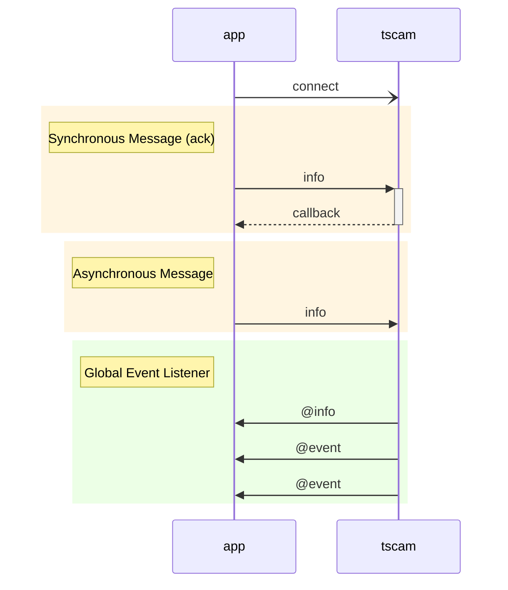

English | [한국어](doc.i18n/ko-KR/DevGuide.md) | [日本語](doc.i18n/ja-JP/DevGuide.md) | [Tiếng Việt](doc.i18n/vi-VN/DevGuide.md)

# Application Development Guide

## Table of Contents
  - [Overview](#overview)
  - [Messages](#messages)
    - [1. `discover` Camera Discovery](#1-discover-camera-discovery)
    - [2. `info` Camera Information](#2-info-camera-information)
    - [3. `snapshot` Snapshot Image](#3-snapshot-snapshot-image)
    - [4. `relayOutput` Relay Output](#4-relayoutput-relay-output)
    - [5. `watchEvents` Event Waiting](#5-watchevents-event-waiting)
    - [6. `unwatchEvents` Event Waiting Termination](#6-unwatchevents-event-waiting-termination)
    - [7. `watchList` Event Waiting List](#7-watchlist-event-waiting-list)
    - [8. `@event` Event](#8-event-event)
  - [License Plate Recognition API](#license-plate-recognition-api)
## Overview

The `TS-CAM` API uses Socket.IO-based real-time message transmission for communication.
The API uses `JSON` for request and response data.
When using synchronous (`ack`) mode, the response to a request is called through a callback function, making it convenient to pair requests and responses.

Conversely, when using asynchronous mode or when the camera sends events, they are received through the application's global event listener. In this case, the `@` character is prefixed to the message to distinguish it as a reverse message from `TS-CAM` to the application.


```mermaid
sequenceDiagram
    participant app
    participant tscam

    app-)tscam: connect
    rect rgb(255, 245, 225)
    note left of app: Synchronous Message (ack)
    app->>+tscam: info
    tscam-->>-app: callback
    end


    rect rgb(255, 245, 225)
    note left of app: Asynchronous Message
    app->>tscam: info
    end

    rect rgb(236, 255, 230)
    note left of app: Global Event Listener
    tscam->>app: @info
    tscam->>app: @event
    tscam->>app: @event
    end
```

## Messages

#### 1. `discover` Camera Discovery

Requests a list of ONVIF-compatible cameras connected to the internal network.

  - Request Parameters
    ```jsx
    {
      "timeout": 1500,        // Time to wait for camera response (milliseconds)
      "device": "Ethernet"    // Network device (uses system default if omitted)
    }
    ```
    - Available network device names for `device` include:
        - Windows: `Ethernet` or `Wi-Fi`
        - Linux: `eth0`, `enp0s3`, `wlan0`

  - Response Data
    - The response data content includes basic information about each camera that can be obtained without logging in, and some items may be missing depending on the manufacturer.
    - `href` is a required field and is used as a key to reference the camera in subsequent messages.
    ```jsx
    {
      "result": true,   // Processing result
      "devices": [      // List of discovered cameras
        {
          "name": "DCC-1M0",
          "type": "NetworkVideoTransmitter",
          "hardware": "DCC-1M0",
          "Profile": [
            "Streaming"
          ],
          "href": "http://192.168.0.30/onvif/device_service"
        },
        {
          "name": "SNP-6320RH",
          "manufacturer": "Hanwha Techwin",          
          "type": "ptz",
          "hardware": "SNP-6320RH",
          "Profile": [
            "Streaming"
          ],
          "href": "http://192.168.0.195:8000/onvif/device_service"
        },
        {
          "name": "Dahua",
          "type": "Network_Video_Transmitter",
          "hardware": "IPC-HFW2231R-ZS-IRE6",
          "Profile": [
            "Streaming"
          ],
          "href": "http://192.168.0.203/onvif/device_service"
        },

        // ... omitted
      ]
    }
    ```

#### 2. `info` Camera Information
Logs in to get detailed camera information.
Since the login state is not maintained, you need to pass `username` and `password` with each request.

  - Request Parameters  
    ```jsx
    {
      "href": "http://192.168.0.30/onvif/device_service", // Target camera
      "alias": "Parking Entrance",  // Name assignment
      "username": "admin",   // Camera login ID
      "password": "admin",   // Camera login password
      "authType": "basic"    // Authentication type
    }
    ```
      - `alias`: If you assign a name to the camera, it will be included in the response data.
      - `authType`: Specify the authentication method (`basic`, `digest`) supported by the camera. If omitted, `basic` is applied as the default value.
  
  - Response Data
      - The content of the `info` item varies by camera manufacturer and specifications.
      **[Important] Among these, `inputPorts` and `outputPorts` must have at least one each to connect and use as loop sensor input and barrier control relay output.**
    ```jsx
    {
      "href": "http://192.168.0.30/onvif/device_service",
      "alias": "Parking Entrance",
      "result": true,         // Processing result
      "info": {
        "manufacturer": "PARANTEK",
        "model": "DCC-1M0",
        "firmwareVersion": "PT_FW_0027",
        "serialNumber": "645C:F3:50:19FD",
        "hardwareId": "PT_HW_DCC_1M0",
        "inputPorts": 2,      // Number of input terminals 
        "outputPorts": 1      // Number of output terminals
      }
    }
    ```

#### 3. `snapshot` Snapshot Image
Requests a snapshot image from the camera.
When loading a snapshot image, it supports image file storage, web image links, and can be set to perform vehicle number recognition.

  - Request Parameters
    ```jsx
    {
      "href": "http://192.168.0.30/onvif/device_service", // Target camera
      "alias": "Parking Entrance",  // Name assignment
      "username": "admin",   // Camera login ID
      "password": "admin",   // Camera login password
      "authType": "basic",   // Authentication type
      "anprOptions": "v"     // TS-ANPR vehicle number recognition options
    }
    ```
    - `alias`: If you name the camera, it will be applied to the image file name and storage directory name.
      The image storage path is structured as follows.
      ```js
      ${TSCAM_DATA_DIR}/${YYYYMMDD}/${alias}/${alias}-${YYYYMMDD}-${hhmmss.SSS}_$lateNo}.jpg
      // ${TSCAM_DATA_DIR} directory set in environment variable
      // ${YYYYMMDD} 8-digit year-month-day
      // ${alias} name specified in request parameters
      // ${hhmmss.SSS} 10-digit hour-minute-second.millisecond
      // ${plateNo} vehicle number
      ```
    - `anprOptions`: These are the [options](https://github.com/bobhyun/TS-ANPR/blob/main/DevGuide.md#12-anpr_read_file) (`v,m,s,d,r`) passed to the license plate recognition engine.
       If you want to perform number recognition without using option characters, set `"anprOptions": ""`,
       If you do not want to use the vehicle number recognition feature, you can omit the `anprOptions` item.
