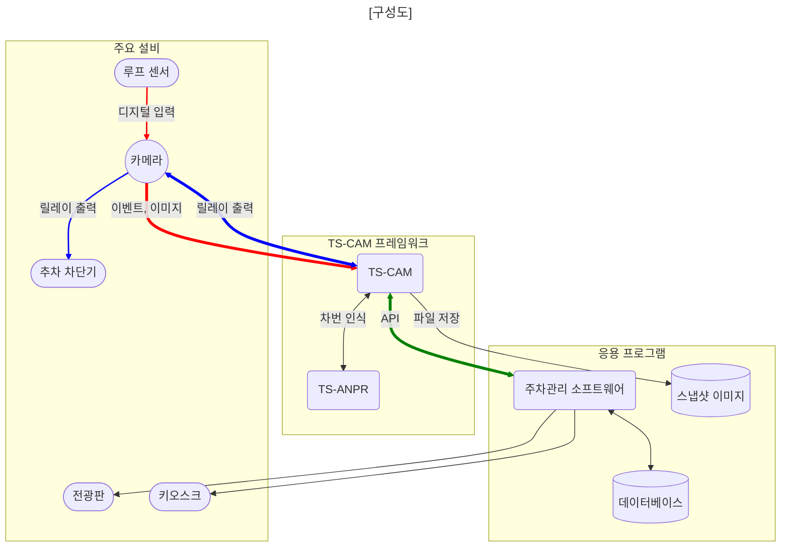

# TS-CAM

TS-CAM은 ONVIF 호환 CCTV 카메라를 차량 번호 인식 용으로 사용할 수 있는 프레임워크입니다.

루프 센서 입력, 스냅샷 이미지 획득, 차량 번호 인식, 차단기 제어, 이미지 저장 기능이 모두 구현되어 있습니다.

카메라와 응용프로그램 사이에서 중계자 역할을 수행하는 서버(브로커)로 동작하며, 응용 프로그램과는 Socket.IO 기반 API를 사용하여 실시간 메시지로 가볍게 통신합니다.

응용 프로그램 예제 코드를 확인해 보세요.

- [Python](https://github.com/bobhyun/TS-CAM/blob/main/examples/python/tscamApp.py)
- [Java](https://github.com/bobhyun/TS-CAM/blob/main/examples/java/tscamApp/src/Main.java)
- [C#](https://github.com/bobhyun/TS-CAM/blob/main/examples/csharp/tscamApp/tscamApp/Program.cs)
- [Node.js](https://github.com/bobhyun/TS-CAM/blob/main/examples/nodejs/index.js)



## 특장점

1. 소프트웨어 개발 생산성 향상
   응용 소프트웨어를 개발할 때 TS-CAM 프레임워크를 도입하면
   **카메라 인테페이스, 차량 번호 인식에 대한 세부사항들은 TS-CAM에 맏기고**
   응용 프로그램은 데이터베이스, 사용자 인터페이스와 같은 **비즈니스 로직에 집중**할 수 있어 개발 생산성이 향상될 수 있습니다.
2. 회복 탄력성
   시스템 서비스로 실행할 수 있기 때문에 소프트웨어 오류로 프로그램이 죽거나 시스템이 재부팅될 경우 자동으로 재실행되므로, **장애 상태로 방치되지 않고 스스로 복구되므로 안정성이 향상**됩니다.
3. 32비트 응용프로그램 성능 향상
   TS-CAM은 응용프로그램과 분리된 별도의 프로그램이기 떄문에 응용프로그램이 32비트라도 CPU와 운영체제가 64비트이면 **TS-CAM을 64비트로 실행**할 수 있습니다.
   이렇게 구성하면 기존 32비트 응용프로그램에서 **주로 CPU부하가 걸리는 부분을 64비트로 처리**하는 효과를 얻을 수 있습니다.
   멀티코어 CPU에서 32비트에 비해 64비트 차번인식 엔진이 **차번 인식속도가 약 2~4배 빠릅니다**.

   ```mermaid
   flowchart LR

   tscam<-->tsanpr(TS-ANPR)
   tscam(TS-CAM)<==>|API|app(응용프로그램)


   subgraph 32비트
   app
   end

   subgraph bit64Framework ["64비트"]
   tscam
   tsanpr
   end

   subgraph bit64OS ["64비트 운영체제"]
   bit64Framework
   32비트
   end

   classDef blue fill:#ccc,color:#fff,stroke:#333;
   class 32비트 blue

   linkStyle 1 stroke:green, stroke-width:4px;
   ```

4. 카메라 선택 폭이 넓어짐
   전용 카메라를 사용해야 하는 제약없이 CCTV 카메라 시장의 주류인 ONVIF 호환 카메라 중에서 **필요한 사양, 성능, 가격에 맞는 카메라를 직접 선정**할 수 있습니다.

## 설치 및 실행 방법

1. 실행 파일은 TS-ANPR 엔진 디렉토리에 포함되어 있습니다.

   ```sh
    tscam.exe              # TS-CAM 실행 파일
    .env                   # 환경 변수 설정 파일
    tsanpr.dll             # TS-ANPR 엔진 파일
    tsanpr-KR-2407M.eon    # TS-ANPR 엔진 파일
   ```

2. 환경변수
   환경변수 설정을 통해 `tscam.exe` 동작을 설정할 수 있습니다.
   환경변수는 서비스 등록시 스크립트 파일에서 설정하거나 간단히 `.env` 파일에 설정할 수 있습니다.
   `.env` 파일은 항상 `tscam.exe` 파일과 같은 디렉토리에 위치해야 합니다.

   ```sh
     TSCAM_HTTP_PORT=10000                    # listen용 TCP 포트 번호
     #TSCAM_DATA_DIR=C:\Users\bob\tscam\data  # 스냅샷 이미지가 저장될 디렉토리
     #TSCAM_LOG_DIR=C:\Users\bob\tscam\log    # 로그가 저장될 디렉토리

     # 시각 표시는 밀리초가 기본으로 사용되는데 초 단위로 변경할 경우 사용
     #TSCAM_NO_MILLISECONDS=1

     # 스냅샷 이미지 URL 경로 prefix
     #TSCAM_URI_DATA_PATH_PREFIX=/site1

     # 차번인식엔진이 tscam.exe와 다른 위치에 있는 경우 설정합니다.
     #TSANPR=C:\Program Files\TS-Solution\TS-ANPR\tsanpr-KR-v2.4.0M\windows-x86_64\tsanpr.dll

     # 로그 파일 설정 (기본값)
     #	maxSize: 로그 파일 하나의 최대 크기
     # 	maxFiles: 보관할 로그 파일 수 (지정한 날짜가 지나면 자동 삭제됨)
     # 	size: 전체 로그 저장소의 최대 크기 (총 로그 크기가 설정한 값을 초과하면 가장 오래된 파일부터 삭제됨)
     # TSCAM_LOG_CONFIG={"maxSize":"20m","maxFiles":"31d","size":"1024m"}

     # 파일 저장 로그 레벨 (info, warn, error 중 하나로 설정)
     TSCAM_LOG_LEVEL_FILE=info        # 모든 로그 저장
     # 콘솔 출력 로그 레벨 (info, warn, error 중 하나로 설정)
     TSCAM_LOG_LEVEL_CONSOLE=info     # 모든 로그 출력
   ```

3. 개발 환경
   개발 환경은 동작 상황이 실시간으로 콘솔에 표시되도록 구성하면 편리합니다.

   - 환경 변수 편집
     실행 환경은 환경 변수를 사용해서 설정 가능하므로 먼저 `.env` 파일을 개발 환경에 맞게 편집합니다. 운영체제의 환경 변수 설정을 사용해도 되지만 개발 환경에서는 간편히 `.env`파일을 사용하는 것을 권장합니다.
     로그가 별도로

     ```sh
     # 파일 저장 로그 레벨 (info, warn, error 중 하나로 설정)
     TSCAM_LOG_LEVEL_FILE=info        # 모든 로그 저장
     # 콘솔 출력 로그 레벨 (info, warn, error 중 하나로 설정)
     TSCAM_LOG_LEVEL_CONSOLE=info     # 모든 로그 출력
     ```

   - TS-CAM 실행
     콘솔 창을 열고 tscam을 실행합니다.
     ```
     C:\Program Files\TS-Solution\TS-ANPR\tsanpr-KR-v2.4.0M\windows-x86_64> tscam
     tscam v0.1.0
     log= C:\Users\bob\tscam\log
     data= C:\Users\bob\tscam\data
     2024-08-09 16:36:35.201 info: Process started { pid: 18764 }
     2024-08-09 16:36:35.446 info: os_name=win32, arch_name=x64
     2024-08-09 16:36:35.448 info: LIB_PATH= 'C:\Program Files\TS-Solution\TS-ANPR\tsanpr-KR-v2.4.0M\windows-x86_64\tsanpr.dll'
     2024-08-09 16:36:36.547 info: TS-ANPR v2.4.0 is ready
     2024-08-09 16:36:36.570 info: listening 127.0.0.1:10000
     ```
   - TS-CAM 종료
     콘솔 창에서 `Ctrl+C` 를 입력하여 프로그램을 종료합니다.
     ```
     2024-08-09 16:37:02.240 info: SIGINT received. Shutting down gracefully
     2024-08-09 16:37:02.243 info: Closing server
     2024-08-09 16:37:03.245 info: Server closed
     2024-08-09 16:37:03.248 info: Socket.IO server closed
     2024-08-09 16:37:03.250 info: Process terminated { pid: 18764 }
     ```

4. 운영 환경 (윈도우즈)
   운영 환경은 회복 탄력성을 위해 시스템 서비스로 실행합니다.

   - 서비스 등록
     먼저 `tscam`과 `TS-ANPR` 디렉토리를 원하는 위치에 복사한 다음, 시스템 서비스로 등록하기 위해 `utils/windows-service/addsvc.bat` 파일 내용 중 필요한 부분을 수정합니다.
     예를 들어, `C:\Program Files\TS-Solution\TS-ANPR\`에 복사했다면 아래와 같이 수정하면 됩니다.

     ```batch
     @echo off

     REM tscam 서비스 설치 스크립트

     REM 관리자 모드로 실행하세요.

     reg Query "HKLM\Hardware\Description\System\CentralProcessor\0" | find /i "x86" > NUL && set NSSM=win32\nssm.exe || set NSSM=win64\nssm.exe

     REM 실제 실행파일의 경로로 수정하세요.
     %NSSM% install tscam "C:\Program Files\TS-Solution\TS-ANPR\tsanpr-KR-v2.4.0M\windowns-x86_64\tscam.exe"
     %NSSM% set tscam AppExit Default Restart
     %NSSM% set tscam AppRestartDelay 3000

     REM 필요한 환경변수 설정
     REM HTTP 포트 번호
     REM %NSSM% set tscam AppEnvironment TSCAM_HTTP_PORT=10000

     REM 데이터 저장 디렉토리
     REM %NSSM% set tscam AppEnvironment "TSCAM_DATA_DIR=C:\ProgramData\TS-Solution\tscam\data"

     REM 로그 파일 디렉토리
     REM %NSSM% set tscam AppEnvironment "TSCAM_LOG_DIR=C:\ProgramData\TS-Solution\tscam\log"

     REM 밀리초 단위 삭제
     REM %NSSM% set tscam AppEnvironment TSCAM_NO_MILLISECONDS=1

     REM 저장 이미지 파일 다운로드 경로 prefix
     REM %NSSM% set tscam AppEnvironment TSCAM_URI_DATA_PATH_PREFIX=/site1"

     REM 콘솔 로그 레벨 (info, warn, error)
     REM 운영 환경에서는 쓰기 부하를 줄이려면 warm, error 수순으로 설정합니다.
     REM %NSSM% set tscam AppEnvironment TSCAM_LOG_LEVEL_CONSOLE=error

     REM 파일 로그 레벨 (info, warn, error)
     REM 운영 환경에서는 쓰기 부하를 줄이려면 warm, error 수순으로 설정합니다.
     REM %NSSM% set tscam AppEnvironment TSCAM_LOG_LEVEL_FILE=error

     REM 로그 파일 설정 (따옴표 두개로 이스케이프 처리)
     REM maxSize: 로그 파일 하나의 최대 크기
     REM maxFiles: 보관할 로그 파일 수 (지정한 날짜가 지나면 자동 삭제됨)
     REM size: 전체 로그 저장소의 최대 크기 (총 로그 크기가 설정한 값을 초과하면 가장 오래된 파일부터 삭제됨)
     REM %NSSM% set tscam AppEnvironment "TSCAM_LOG_CONFIG={""maxSize"":""20m"",""maxFiles"":""31d"",""size"":""1024m""}"

     REM 차번인식엔진이 tscam.exe와 다른 위치에 있는 경우 설정합니다.
     REM %NSSM% set tscam AppEnvironment "TSANPR=C:\Program Files\TS-Solution\TS-ANPR\tsanpr-KR-v2.4.0M\windows-x86_64\tsanpr.dll"

     %NSSM% start tscam
     %NSSM% status tscam

     ```

     수정한 `addsvc.bat` 파일을 저장한 다음 관리자 모드에서 실행하면 등록이 완료됩니다.

   - 서비스 삭제
     등록한 `tscam` 서비스를 삭제하려면 관리자 모드에서 `utils/windows-service/rmsvc.bat`를 실행하세요.

5. 운영환경 (리눅스)

   - 서비스 등록
     시스템 서비스로 등록하기 위해 `utils/linux-service/addsvc.sh` 파일 내용 중 필요한 부분을 수정합니다.
     예를 들어, `/var/tsanpr/`에 복사했다면 아래와 같이 수정하면 됩니다.

   ```sh
   #!/bin/bash

   # tscam 서비스 등록 스크립트

   echo "# tscam configuration

   [Unit]
   Description=tscam (ONVIF Camera Broker)
   After=network.target

   [Service]
   # HTTP 포트 번호
   # Environment=\"TSCAM_HTTP_PORT=10000\"

   # 데이터 저장 디렉토리
   # Environment=\"TSCAM_DATA_DIR=/var/tscam/data\"

   # 로그 파일 디렉토리
   # Environment=\"TSCAM_LOG_DIR=/var/tscam/log\"

   # 밀리초 단위 삭제
   # Environment=\"TSCAM_NO_MILLISECONDS=1\"

   # 저장 이미지 파일 다운로드 경로 prefix
   # Environment=\"TSCAM_URI_DATA_PATH_PREFIX=/site1\"

   # 콘솔 로그 레벨 (info, warn, error)
   # Environment=\"TSCAM_LOG_LEVEL_CONSOLE=error\"

   # 파일 로그 레벨 (info, warn, error)
   # Environment=\"TSCAM_LOG_LEVEL_FILE=error\"

   # 로그 파일 설정
   # 	maxSize: 로그 파일 하나의 최대 크기
   # 	maxFiles: 보관할 로그 파일 수 (지정한 날짜가 지나면 자동 삭제됨)
   # 	size: 전체 로그 저장소의 최대 크기 (총 로그 크기가 설정한 값을 초과하면 가장 오래된 파일부터 삭제됨)
   # Environment=\"TSCAM_LOG_CONFIG={\\\"maxSize\\\":\\\"20m\\\",\\\"maxFiles\\\":\\\"31d\\\",\\\"size\\\":\\\"1024m\\\"}\"

   # 차번인식엔진이 tscam.exe와 다른 위치에 있는 경우 설정합니다.
   # Environment=\"TSANPR=/var/tsanpr/tsanpr-KR-v2.4.0M/linux-x86_64/libtsanpr.so\"

   # 필수 항목
   WorkingDirectory=/var/tscam

   # tscam 실행 파일 경로
   ExecStart=/var/tsanpr/tsanpr-KR-v2.4.0M/linux-x86_64/tscam

   # 죽으면 3초 후 자동 재시작
   Restart=always
   RestartSec=3
   LimitNOFILE=400000
   Type=simple

   [Install]
   WantedBy=multi-user.target
   " > ~/.tmp.tscam.service
   sudo mv ~/.tmp.tscam.service /etc/systemd/system/tscam.service

   sudo systemctl daemon-reload
   sudo systemctl enable tscam
   sudo systemctl restart tscam
   ```

   - 서비스 삭제
     등록한 `tscam` 서비스를 삭제하려면 관리자 모드에서 `utils/linux-service/rmsvc.sh`를 실행하세요.

## 라이선스

`TS-CAM`은 번들로 제공되며 무료로 사용할 수 있습니다.
다만 `TS-ANPR`이 설치되어 있어야 동작하며 `TS-ANPR` 라이선스에 의존합니다.
`TS-ANPR`은 동시에 이벤트 수신 대기 `watchEvent` 하는 최대 카메라 수를 라이선스로 제한하고 있습니다.

| TS-ANPR 라이선스 | 카메라 수 제한                              |
| ---------------- | :------------------------------------------ |
| 무료 평가판      | 최대 4대                                    |
| 상용 라이선스    | 기본 1대 (카메라 추가시 라이선스 구매 가능) |
