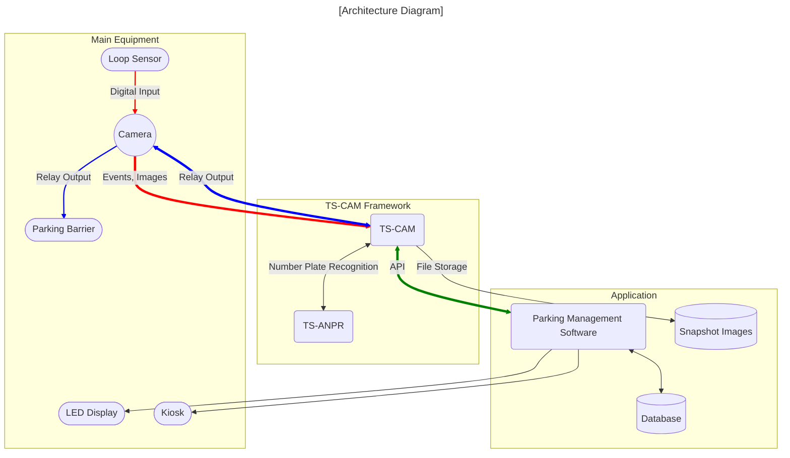

English | [한국어](doc.i18n/ko-KR/README.md) | [日本語](doc.i18n/ja-JP/README.md) | [Tiếng Việt](doc.i18n/vi-VN/README.md)

# TS-CAM

TS-CAM is a framework that enables ONVIF-compatible CCTV cameras to be used for vehicle number recognition.

---

##### [😍 TS-ANPR Live Demo](http://tsnvr.ipdisk.co.kr/) <span style="font-size:.7em;font-weight:normal;color:grey">👈 Test number plate recognition performance here.</span>


##### 🚀 Download Latest Versions

- [TS-CAM](https://github.com/bobhyun/TS-CAM/releases/)
- [TS-ANPR](https://github.com/bobhyun/TS-ANPR/releases/)

##### 🎨 Code Samples in Popular Languages

- [C#](examples/C%23/tscam-app) | [F#](examples/F%23/tscam-app) | [Java](examples/Java/tscam-app) | [JavaScript](examples/JavaScript/tscam-app) | [Kotlin](examples/Kotlin/tscam-app) [Python](examples/Python/tscam-app) | [TypeScript](examples/TypeScript/tscam-app) | [VB.NET](examples/VB.NET/tscam-app)


##### 📖 Application Development Guide

- [TS-CAM](DevGuide.md)
- [TS-ANPR](https://github.com/bobhyun/TS-ANPR/blob/main/DevGuide.md)

##### [🎁 How to install](Usage.md)

##### [⚖️ License](LICENSE.md)

_If you have any questions or requests, please feel free to open an [Issues](https://github.com/bobhyun/TS-ANPR/issues).
We are happy to assist and welcome your feedback!_

- Inquiry: 📧 skju3922@naver.com

---

## Table of Contents
- [Latest Version Information](#latest-version-information)
- [Overview](#overview)
- [Features](#features)

---

## Latest Version Information

#### Release v0.2.1 (2025.6.4)🎉
   - `TS-CAM` has been separated from `TS-ANPR`.
   - Support for HTTPS cameras using self-signed certificates
   - Support for `minChar`, `country` a and `symbol` added in TS-ANPR v3.0.0

## Overview
Loop sensor input, snapshot image acquisition, vehicle number recognition, barrier control, and image storage functions are all implemented.

It acts as a server (broker) that mediates between the camera and the application, and communicates with the application through a lightweight Socket.IO-based API in real-time messages.


```mermaid
---
title: "[Architecture Diagram]"
---
flowchart

loop([Loop Sensor])-->|Digital Input|camera((Camera))
camera-->|Events, Images|tscam(TS-CAM)

tscam<==>|Relay Output|camera
camera-->|Relay Output|gate([Parking Barrier])

tscam<==>|API|app(Parking Management Software)
tscam<-->|Number Plate Recognition|tsanpr(TS-ANPR)
tscam-->|File Storage|images[(Snapshot Images)]
app-->led([LED Display])
app-->kiosk([Kiosk])
app<-->db[(Database)]

subgraph framework ["TS-CAM Framework"]
tscam
tsanpr
end

subgraph applicaton ["Application"]
images
app
db
end

subgraph devices ["Main Equipment"]
loop
camera
gate
led
kiosk
end

linkStyle 0 stroke:red, stroke-width:2px;
linkStyle 1 stroke:red, stroke-width:4px;
linkStyle 2 stroke:blue, stroke-width:4px;
linkStyle 3 stroke:blue, stroke-width:2px;
linkStyle 4 stroke:green, stroke-width:4px;
```

## Features

1. Improved Software Development Productivity
   When developing an application software using the TS-CAM framework,
   **Camera interface and vehicle number recognition details can be handled by TS-CAM**
   while the application can focus on **business logic such as databases and user interfaces**, which can improve development productivity.
2. Resilience
   Since it can run as a system service, when the software crashes or the system reboots, it automatically restarts, so **it can recover itself without being left in a failure state, improving stability**.
3. Improved Performance of 32-bit Applications
   Since TS-CAM is a separate program from the application, even if the application is 32-bit, TS-CAM can run in 64-bit when the CPU and operating system are 64-bit.
   This configuration allows the existing 32-bit application to **process the CPU-intensive part in 64-bit**.
   On multi-core CPUs, the 64-bit license plate recognition engine runs about **2-4 times faster than 32-bit**.

   ```mermaid
   flowchart LR

   tscam<-->tsanpr(TS-ANPR)
   tscam(TS-CAM)<==>|API|app(Application)


   subgraph 32-bit
   app
   end

   subgraph bit64Framework ["64-bit"]
   tscam
   tsanpr
   end

   subgraph bit64OS ["64-bit Operating System"]
   bit64Framework
   32-bit
   end

   classDef blue fill:#ccc,color:#fff,stroke:#333;
   class 32-bit blue

   linkStyle 1 stroke:green, stroke-width:4px;
   ```

4. Wider Camera Selection
   Instead of being constrained to use dedicated cameras, you can select cameras that match your **required specifications, performance, and price** from ONVIF-compatible cameras, which are the mainstream in the CCTV camera market.
