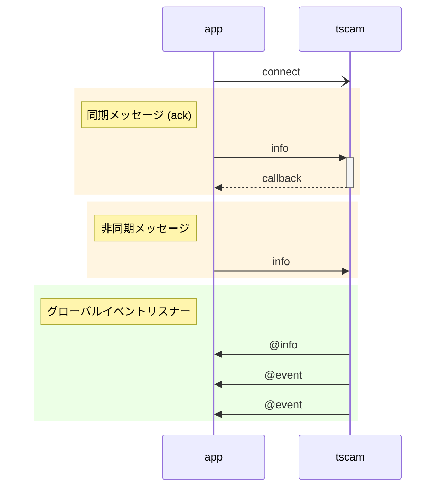

[English](../../DevGuide.md) | [한국어](../ko-KR/DevGuide.md) | 日本語 | [Tiếng Việt](../vi-VN/DevGuide.md)

# アプリケーション開発ガイド

## 目次
  - [概要](#概要)
  - [メッセージ](#メッセージ)
    - [1. `discover` カメラ検索](#1-discover-カメラ検索)
    - [2. `info` カメラ情報](#2-info-カメラ情報)
    - [3. `snapshot` スナップショット画像](#3-snapshot-スナップショット画像)
    - [4. `relayOutput` リレー出力](#4-relayoutput-リレー出力)
    - [5. `watchEvents` イベント受信待ち](#5-watchevents-イベント受信待ち)
    - [6. `unwatchEvents` イベント受信終了](#6-unwatchevents-イベント受信終了)
    - [7. `watchList` イベント受信待ちリスト](#7-watchlist-イベント受信待ちリスト)
    - [8. `@event` イベント](#8-event-イベント)
  - [ナンバープレート認識 API](#ナンバープレート認識-api)
## 概要

`TS-CAM` APIはSocket.IOベースのリアルタイムメッセージ送信方式で通信します。
APIは要求と応答データで`JSON`を使用します。
同期(`ack`)方式を使用すると、要求に対する応答がコールバック関数として呼び出されるため、要求と応答を一対として構成しやすいです。

逆に非同期方式やカメラからイベントを送信する場合は、アプリケーションのグローバルイベントリスナーを通じて受信されます。この場合、`TS-CAM`からアプリケーション方向への逆方向メッセージを意味する`@`文字をメッセージの前に付けて区別します。



## メッセージ

#### 1. `discover` カメラ検索

内部ネットワークに接続されたONVIF互換カメラのリストを要求します。

  - 要求パラメータ
    ```jsx
    {
      "timeout": 1500,        // カメラが応答を待つ時間 (ミリ秒)
      "device": "Ethernet"    // ネットワークデバイス (省略するとシステムのデフォルト値で動作)
    }
    ```
    - `device`に使用できるネットワークデバイスの名前は以下の通りです。
        - Windows: `Ethernet`または`Wi-Fi`
        - Linux: `eth0`, `enp0s3`, `wlan0`

  - 応答データ
    - 応答データの内容のうち各カメラ情報はログインせずに取得できる基本情報で、製造元によってはいくつかの項目が存在しない場合もあります。
    - `href`は必須項目で、その後のメッセージでカメラを参照するキー値として使用されます。
    ```jsx
    {
      "result": true,   // 処理結果
      "devices": [      // 検索されたカメラリスト
        {
          "name": "DCC-1M0",
          "type": "NetworkVideoTransmitter",
          "hardware": "DCC-1M0",
          "Profile": [
            "Streaming"
          ],
          "href": "http://192.168.0.30/onvif/device_service"
        },
        {
          "name": "SNP-6320RH",
          "manufacturer": "Hanwha Techwin",          
          "type": "ptz",
          "hardware": "SNP-6320RH",
          "Profile": [
            "Streaming"
          ],
          "href": "http://192.168.0.195:8000/onvif/device_service"
        },
        {
          "name": "Dahua",
          "type": "Network_Video_Transmitter",
          "hardware": "IPC-HFW2231R-ZS-IRE6",
          "Profile": [
            "Streaming"
          ],
          "href": "http://192.168.0.203/onvif/device_service"
        },

        // ... 省略
      ]
    }
    ```

#### 2. `info` カメラ情報
ログインしてカメラの詳細情報を取得します。
ログイン状態は保持されないため、要求するたびに`username`と`password`を渡す必要があります。

  - 要求パラメータ  
    ```jsx
    {
      "href": "http://192.168.0.30/onvif/device_service", // 対象カメラ
      "alias": "駐車場入口",  // 名前指定
      "username": "admin",   // カメラログインID
      "password": "admin",   // カメラログインパスワード
      "authType": "basic"    // 認証方式
    }
    ```
      - `alias`: カメラに名前を付けると応答データに付いてきます。
      - `authType`: `basic`, `digest`のいずれかのカメラがサポートする認証方式を指定します。省略するとデフォルト値として`basic`が適用されます。
  
  - 応答データ
      - `info`項目の内容はカメラ製造元と仕様によって異なります。
      **[重要] これらの中で`inputPorts`と`outputPorts`がそれぞれ1つ以上ある場合のみ、ループセンサー入力とバリア制御用リレー出力として接続して使用できます。**
    ```jsx
    {
      "href": "http://192.168.0.30/onvif/device_service",
      "alias": "駐車場入口",
      "result": true,         // 処理結果
      "info": {
        "manufacturer": "PARANTEK",
        "model": "DCC-1M0",
        "firmwareVersion": "PT_FW_0027",
        "serialNumber": "645C:F3:50:19FD",
        "hardwareId": "PT_HW_DCC_1M0",
        "inputPorts": 2,      // 入力端子数 
        "outputPorts": 1      // 出力端子数
      }
    }
    ```

#### 3. `snapshot` スナップショット画像
カメラにスナップショット画像を要求します。
スナップショット画像を読み込むと、画像ファイル保存、ウェブ画像リンクを基本サポートし、車両ナンバープレート認識を実行するように設定できます。

  - 要求パラメータ
    ```jsx
    {
      "href": "http://192.168.0.30/onvif/device_service", // 対象カメラ
      "alias": "駐車場入口",  // 名前指定
      "username": "admin",   // カメラログインID
      "password": "admin",   // カメラログインパスワード
      "authType": "basic",   // 認証方式
      "anprOptions": "v"     // TS-ANPR車両ナンバープレート認識オプション
    }
    ```
    - `alias`: カメラに名前を付けると画像ファイル名と保存ディレクトリ名に適用されます。
      画像保存パスは以下の通りに構成されます。
      ```js
      ${TSCAM_DATA_DIR}/${YYYYMMDD}/${alias}/${alias}-${YYYYMMDD}-${hhmmss.SSS}_$lateNo}.jpg
      // ${TSCAM_DATA_DIR} 環境変数に設定したディレクトリ
      // ${YYYYMMDD} 年月日8桁
      // ${alias} 要求パラメータに指定した名前
      // ${hhmmss.SSS} 時分秒.ミリ秒10桁
      // ${plateNo} 車両番号
      ```
    - `anprOptions`: 車両ナンバープレート認識エンジンに渡される[options](https://github.com/bobhyun/TS-ANPR/blob/main/DevGuide.md#12-anpr_read_file)項目(`v,m,s,d,r`)です。
       オプション文字を使用せずにナンバープレート認識を実行したい場合は`"anprOptions": ""`のように設定し、
       もし車両ナンバープレート認識機能を使用しない場合は`anprOptions`項目を省略するとできます。
