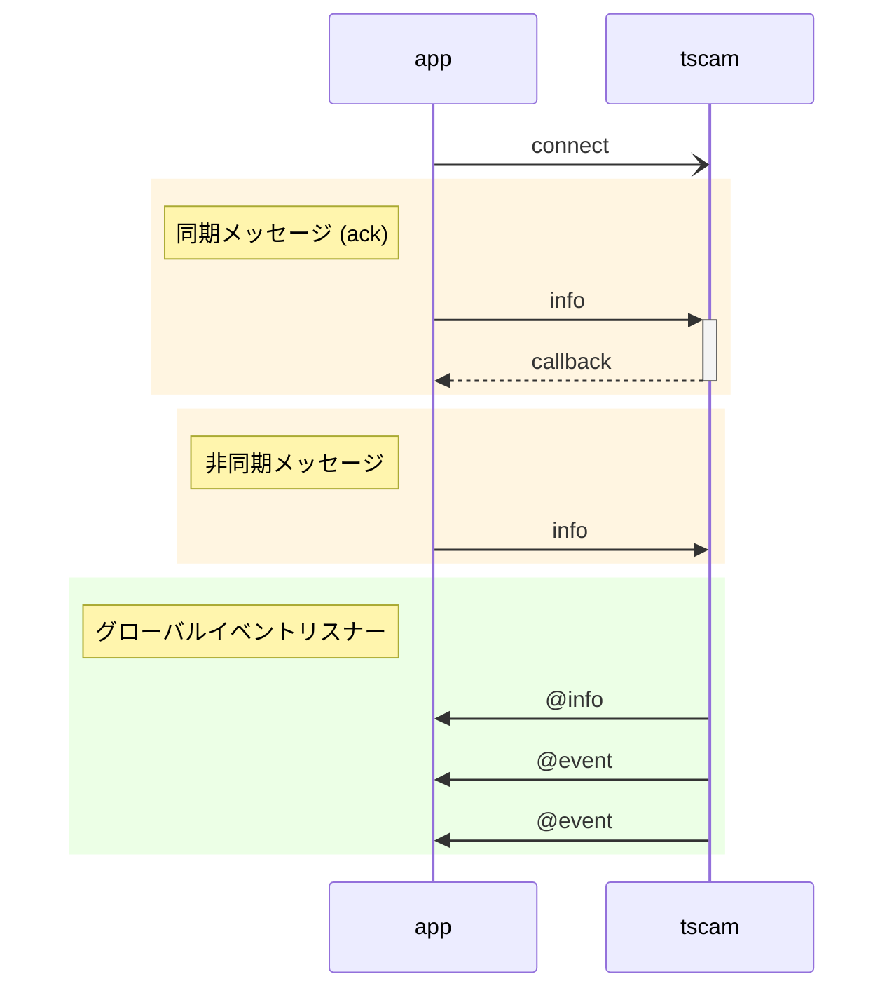
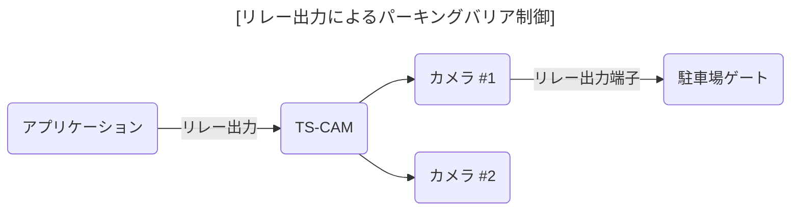
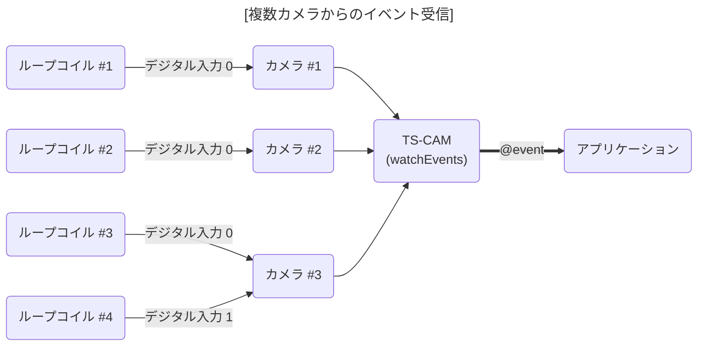
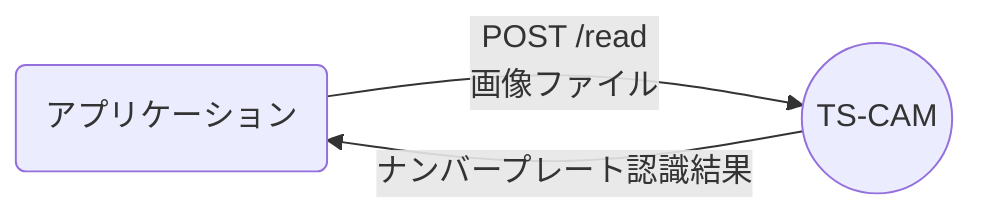

[English](../../DevGuide.md) | [한국어](../ko-KR/DevGuide.md) | 日本語 | [Tiếng Việt](../vi-VN/DevGuide.md)

# アプリケーション開発ガイド

## 目次

- [概要](#概要)
- [メッセージ](#メッセージ)
  - [1. `discover` カメラ検索](#1-discover-カメラ検索)
  - [2. `info` カメラ情報](#2-info-カメラ情報)
  - [3. `snapshot` スナップショット画像](#3-snapshot-スナップショット画像)
  - [4. `relayOutput` リレー出力](#4-relayoutput-リレー出力)
  - [5. `watchEvents` イベント受信待ち](#5-watchevents-イベント受信待ち)
  - [6. `unwatchEvents` イベント受信終了](#6-unwatchevents-イベント受信終了)
  - [7. `watchList` イベント受信待ちリスト](#7-watchlist-イベント受信待ちリスト)
  - [8. `@event` イベント](#8-event-イベント)
- [ナンバープレート認識 API](#ナンバープレート認識-api)

## 概要

`TS-CAM` API は Socket.IO ベースのリアルタイムメッセージ送信方式で通信します。
API は要求と応答データで`JSON`を使用します。
同期(`ack`)方式を使用すると、要求に対する応答がコールバック関数として呼び出されるため、要求と応答を一対として構成しやすいです。

逆に非同期方式やカメラからイベントを送信する場合は、アプリケーションのグローバルイベントリスナーを通じて受信されます。この場合、`TS-CAM`からアプリケーション方向への逆方向メッセージを意味する`@`文字をメッセージの前に付けて区別します。



## メッセージ

#### 1. `discover` カメラ検索

内部ネットワークに接続された ONVIF 互換カメラのリストを要求します。

- 要求パラメータ

  ```jsx
  {
    "timeout": 1500,        // カメラが応答を待つ時間 (ミリ秒)
    "device": "Ethernet"    // ネットワークデバイス (省略するとシステムのデフォルト値で動作)
  }
  ```

  - `device`に使用できるネットワークデバイスの名前は以下の通りです。
    - Windows: `Ethernet`または`Wi-Fi`
    - Linux: `eth0`, `enp0s3`, `wlan0`

- 応答データ

  - 応答データの内容のうち各カメラ情報はログインせずに取得できる基本情報で、製造元によってはいくつかの項目が存在しない場合もあります。
  - `href`は必須項目で、その後のメッセージでカメラを参照するキー値として使用されます。

  ```jsx
  {
    "result": true,   // 処理結果
    "devices": [      // 検索されたカメラリスト
      {
        "name": "DCC-1M0",
        "type": "NetworkVideoTransmitter",
        "hardware": "DCC-1M0",
        "Profile": [
          "Streaming"
        ],
        "href": "http://192.168.0.30/onvif/device_service"
      },
      {
        "name": "SNP-6320RH",
        "manufacturer": "Hanwha Techwin",
        "type": "ptz",
        "hardware": "SNP-6320RH",
        "Profile": [
          "Streaming"
        ],
        "href": "http://192.168.0.195:8000/onvif/device_service"
      },
      {
        "name": "Dahua",
        "type": "Network_Video_Transmitter",
        "hardware": "IPC-HFW2231R-ZS-IRE6",
        "Profile": [
          "Streaming"
        ],
        "href": "http://192.168.0.203/onvif/device_service"
      },

      // ... 省略
    ]
  }
  ```

#### 2. `info` カメラ情報

ログインしてカメラの詳細情報を取得します。
ログイン状態は保持されないため、要求するたびに`username`と`password`を渡す必要があります。

- 要求パラメータ

  ```jsx
  {
    "href": "http://192.168.0.30/onvif/device_service", // 対象カメラ
    "alias": "駐車場入口",  // 名前指定
    "username": "admin",   // カメラログインID
    "password": "admin",   // カメラログインパスワード
    "authType": "basic"    // 認証方式
  }
  ```

  - `alias`: カメラに名前を付けると応答データに付いてきます。
  - `authType`: `basic`, `digest`のいずれかのカメラがサポートする認証方式を指定します。省略するとデフォルト値として`basic`が適用されます。

- 応答データ
  - `info`項目の内容はカメラ製造元と仕様によって異なります。
    **[重要] これらの中で`inputPorts`と`outputPorts`がそれぞれ 1 つ以上ある場合のみ、ループセンサー入力とバリア制御用リレー出力として接続して使用できます。**
  ```jsx
  {
    "href": "http://192.168.0.30/onvif/device_service",
    "alias": "駐車場入口",
    "result": true,         // 処理結果
    "info": {
      "manufacturer": "PARANTEK",
      "model": "DCC-1M0",
      "firmwareVersion": "PT_FW_0027",
      "serialNumber": "645C:F3:50:19FD",
      "hardwareId": "PT_HW_DCC_1M0",
      "inputPorts": 2,      // 入力端子数
      "outputPorts": 1      // 出力端子数
    }
  }
  ```

#### 3. `snapshot` スナップショット画像

カメラにスナップショット画像を要求します。
スナップショット画像を読み込むと、画像ファイル保存、ウェブ画像リンクを基本サポートし、車両ナンバープレート認識を実行するように設定できます。

- 要求パラメータ

  ```jsx
  {
    "href": "http://192.168.0.30/onvif/device_service", // 対象カメラ
    "alias": "駐車場入口",  // 名前指定
    "username": "admin",   // カメラログインID
    "password": "admin",   // カメラログインパスワード
    "authType": "basic",   // 認証方式
    "anprOptions": "v"     // TS-ANPR車両ナンバープレート認識オプション
  }
  ```

  - `alias`: カメラに名前を付けると画像ファイル名と保存ディレクトリ名に適用されます。
    画像保存パスは以下の通りに構成されます。
    ```js
    ${TSCAM_DATA_DIR}/${YYYYMMDD}/${alias}/${alias}-${YYYYMMDD}-${hhmmss.SSS}_${plateNo}.jpg
    // ${TSCAM_DATA_DIR} 環境変数に設定したディレクトリ
    // ${YYYYMMDD} 年月日8桁
    // ${alias} 要求パラメータに指定した名前
    // ${hhmmss.SSS} 時分秒.ミリ秒10桁
    // ${plateNo} 車両番号
    ```
  - `anprOptions`: 車両ナンバープレート認識エンジンに渡される[options](https://github.com/bobhyun/TS-ANPR/blob/main/DevGuide.md#12-anpr_read_file)項目(`v,m,s,d,r`)です。
    オプション文字を使用せずにナンバープレート認識を実行したい場合は`"anprOptions": ""`のように設定し、
    もし車両ナンバープレート認識機能を使用しない場合は`anprOptions`項目を省略するとできます。

- 応答データ
  ```jsx
  {
    "href": "http://192.168.0.30/onvif/device_service",
    "alias": "駐車場入口",
    "result": true,
    "anpr": [       // ナンバープレート認識結果（anprOptionsを使用した場合）
      {
        "area": {
          "angle": 0.927,
          "height": 51,
          "width": 216,
          "x": 1011,
          "y": 525
        },
        "attrs": {
          "ev": false
        },
        "conf": {
          "ocr": 0.958,
          "plate": 0.8966
        },
        "elapsed": 0.0545,
        "ev": false,
        "text": "864고2097"
      }
    ],
    "image": {
      "filePath": "D:\\tmp\\tscam\\data\\20240812\\駐車場入口\\駐車場入口-20240812-113131.027_864고2097.jpg", // 保存されたファイルパス
      "uri": "http://127.0.0.1:10000/data/20240812/駐車場入口/駐車場入口-20240812-113131.027_864고2097.jpg" // 画像リンク
    }
  }
  ```

#### 4. `relayOutput` リレー出力

リレー出力を制御します。
リレー出力は 1 台のカメラに対して行うため、最大カメラ台数などのライセンス制限はありません。



- 要求パラメータ

  ```jsx
  {
    "href": "http://192.168.0.30/onvif/device_service", // 対象カメラ
    "alias": "駐車場入口",  // 名前指定
    "username": "admin",   // カメラログインID
    "password": "admin",   // カメラログインパスワード
    "authType": "basic",   // 認証方式
    "port": 0,            // リレー出力ポート番号
    "value": 1            // 出力値（0: オフ、1: オン）
  }
  ```

- 応答データ
  ```jsx
  {
    "href": "http://192.168.0.30/onvif/device_service",
    "alias": "駐車場入口",
    "result": true,
    "message": "ポート0のリレー出力値を1に設定しました。"
  }
  ```

#### 5. `watchEvents` イベント受信待ち

カメラからトリガー入力（デジタル入力）が発生した場合にイベントを受信するように設定します。
イベント受信待ちは下図のように複数のカメラから同時にイベントを受信できる機能です。
同時に監視できるカメラの最大台数は`TS-ANPR`ライセンスに従います。



- 要求パラメータ
  `watchEvents`要求は配列を使用して複数のカメラを表現します。

  ```jsx
  {
    "watchList": [
      {
        "href": "http://192.168.0.30/onvif/device_service", // 対象カメラ
        "alias": "駐車場入口",  // 名前指定
        "username": "admin",   // カメラログインID
        "password": "admin",   // カメラログインパスワード
        "authType": "basic",   // 認証方式
        "anprOptions": "v",    // TS-ANPR車両ナンバープレート認識オプション
        "snapshot": true       // イベント発生時にスナップショット画像を取得
      },
      {
        "href": "http://192.168.0.195:8000/onvif/device_service",
        "alias": "駐車場出口",
        "username": "admin",
        "password": "admin",
        "authType": "basic",
        "anprOptions": "v",
        "snapshot": true
      }
    ]
  }
  ```

  - `anprOptions`: イベント発生時にスナップショット画像を取得して車両ナンバープレート認識を実行します。
  - `snapshot`: イベント発生時にスナップショット画像を取得します。
    `anprOptions`も`snapshot`も設定しない場合は、イベント入力データのみを受信します。

- 応答データ
  応答データにはイベント受信待ちに設定した対象カメラの応答が`watchList`に含まれます。各カメラの`result`が`true`の場合、イベント受信待ち状態に正常に設定されたことを意味します。
  ```jsx
  {
    "result": true,
    "watchList": [
      {
        "href": "http://192.168.0.30/onvif/device_service",
        "alias": "駐車場入口",
        "result": true, // カメラ応答
        "message": "イベント受信待ちに正常に設定されました"
      },
      {
        "href": "http://192.168.0.195:8000/onvif/device_service",
        "alias": "駐車場出口",
        "result": true,
        "message": "イベント受信待ちに正常に設定されました"
      }
    ]
  }
  ```

#### 6. `unwatchEvents` イベント受信終了

イベント受信待ちを終了します。

- 要求パラメータ

  ```jsx
  {
    "watchList": [
      {
        "href": "http://192.168.0.30/onvif/device_service", // 対象カメラ
        "alias": "駐車場入口"  // 名前指定
      },
      {
        "href": "http://192.168.0.195:8000/onvif/device_service",
        "alias": "駐車場出口"
      }
    ]
  }
  ```

- 応答データ
  ```jsx
  {
    "result": true,
    "watchList": [
      {
        "href": "http://192.168.0.30/onvif/device_service",
        "alias": "駐車場入口",
        "result": true,
        "message": "イベント受信待ちを終了しました"
      },
      {
        "href": "http://192.168.0.195:8000/onvif/device_service",
        "alias": "駐車場出口",
        "result": true,
        "message": "イベント受信待ちを終了しました"
      }
    ]
  }
  ```

#### 7. `watchList` イベント受信待ちリスト

`watchEvents`、`unwatchEvents`要求は一度に行うこともできますが、複数回に分けて要求することもできます。
そのため、現在イベント受信待ち状態のカメラリストを確認する必要がある場合があります。

- 要求パラメータ
  なし

- 応答データ
  ```jsx
  {
    "result": true,
    "watchList": [
      {
        "href": "http://192.168.0.30/onvif/device_service",
        "alias": "駐車場入口",
        "anprOptions": "v",
        "snapshot": true
      },
      {
        "href": "http://192.168.0.195:8000/onvif/device_service",
        "alias": "駐車場出口",
        "anprOptions": "v",
        "snapshot": true
      }
    ]
  }
  ```

#### 8. `@event` イベント

イベント受信待ち状態のカメラでイベントが発生すると`@event`を受信します。
`watchEvents`要求時に設定した`anprOptions`、`snapshot`オプションに応じて、車両ナンバープレート認識結果とスナップショット画像が含まれます。

- イベントデータ

  ```jsx
  {
    "href": "http://192.168.0.30/onvif/device_service",
    "alias": "駐車場入口",
    "result": true,
    "event": {
      "source": {
        "simpleItem": [
          {
            "name": "InputToken",
            "value": "1"
          }
        ]
      },
      "data": {
        "simpleItem": [
          {
            "name": "LogicalState",
            "value": "1"
          }
        ]
      }
    },
    "image": {
      "filePath": "D:\\tmp\\tscam\\data\\20240812\\駐車場入口\\駐車場入口-20240812-142956.985_864고2097.jpg",
      "uri": "http://127.0.0.1:10000/data/20240812/駐車場入口/駐車場入口-20240812-142956.985_864고2097.jpg"
    },
    "anpr": [
      {
        "area": {
          "angle": 0.927,
          "height": 51,
          "width": 216,
          "x": 1011,
          "y": 525
        },
        "attrs": {
          "ev": false
        },
        "conf": {
          "ocr": 0.958,
          "plate": 0.8966
        },
        "elapsed": 0.0545,
        "ev": false,
        "text": "864고2097"
      }
    ]
  }
  ```

  訪問車両のナンバーを判定してパーキングバリアを開く機能を実装する場合、`@event`メッセージを受信したら`anpr.text`をデータベースで照会し、条件に一致する場合は`relayOutput`要求を送信してバリアを開くことができます。

  なお、1 つの`TS-ANPR`に複数のアプリケーションが接続されている場合、イベントが発生すると`@event`メッセージは全てのアプリケーションに同時にブロードキャストされます。

  ```mermaid
  ---
  title: "[複数アプリケーション接続時のイベントブロードキャスト]"
  ---
  flowchart LR

  loop1(ループコイル #1)-->|デジタル入力 0|cam1
  cam1(カメラ #1)-->tscam("TS-CAM</br>(watchEvent)")
  tscam==>|"@event"|app1(アプリケーション #1)
  tscam==>|"@event"|app2(アプリケーション #2)
  tscam==>|"@event"|app3(アプリケーション #3)
  tscam==>|"@event"|app4(アプリケーション #4)
  app1-->|relayOutput|tscam
  app2-->|画像分析|app2
  app3-->|画像アップロード|storage[(大容量ストレージ)]
  app4-->|API|Payment
  app1<-->db[(データベース)]
  ```

  このようなイベントブロードキャスト構造を利用して、上図のように各アプリケーションの機能をマイクロサービスアーキテクチャとして分割することができます。

## ナンバープレート認識 API

アプリケーション開発の利便性のために、ナンバープレート認識 API を提供します。
下図のように`TS-CAM`サーバーに画像ファイルをアップロードすると、ナンバープレート認識結果を返します。



サーバーにアップロードされた画像は、ナンバープレート認識後にメモリバッファから削除され、別途保存されません。

- エンドポイント: **POST /read**

- パラメータ:

  - `options`: [ナンバープレート認識オプション(`vmsdr`)](https://github.com/bobhyun/TS-ANPR/blob/main/DevGuide.md#12-anpr_read_file)

- リクエストボディ:

  - `Content-Type: multipart/form-data`
  - `image`: 分析する画像ファイル（必須）

- レスポンス:

  - `200 OK`: 成功
    - レスポンスボディ:
      - `Content-Type: application/json`
      - 指定された`options`に応じて[ナンバープレート認識結果](https://github.com/bobhyun/TS-ANPR/blob/main/DevGuide.md#213-json)または[物体認識結果](https://github.com/bobhyun/TS-ANPR/blob/main/DevGuide.md#222-json)
  - `400 Bad Request`: 無効なリクエスト
  - `500 Internal Server Error`: サーバーエラー

- 例

  - リクエスト

    ```http
    POST http://127.0.0.1/read?options=v
    Content-Type: multipart/form-data; boundary=----WebKitFormBoundary7MA4YWxkTrZu0gW

    ------WebKitFormBoundary7MA4YWxkTrZu0gW
    Content-Disposition: form-data; name="image"; filename="car.jpg"
    Content-Type: image/jpeg

    (画像ファイルのバイナリデータ)
    ------WebKitFormBoundary7MA4YWxkTrZu0gW--
    ```

  - レスポンス

    ```json
    HTTP/1.1 200 OK
    Content-Type: application/json

    [
      {
        "area": {
            "angle": 1.4943,
            "height": 63,
            "width": 200,
            "x": 1988,
            "y": 569
        },
        "attrs": {
            "ev": false
        },
        "conf": {
            "ocr": 0.9357,
            "plate": 0.8767
        },
        "elapsed": 0.0268,
        "ev": false,
        "text": "123あ5678"
      }
    ]
    ```
