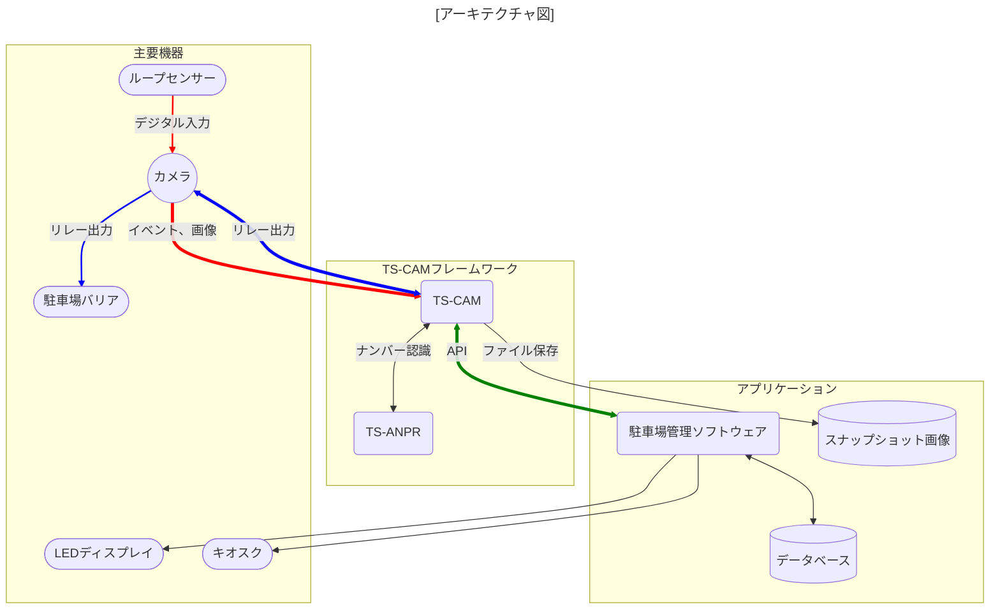

[English](../../README.md) | [한국어](../ko-KR/README.md) | 日本語 | [Tiếng Việt](../vi-VN/README.md)

# TS-CAM

TS-CAM は、ONVIF 対応 CCTV カメラを車両ナンバー認識に活用できるフレームワークです。

---

##### [😍 TS-ANPR ライブデモ](http://tsnvr.ipdisk.co.kr/) <span style="font-size:.7em;font-weight:normal;color:grey">👈 ここでナンバー認識性能をテストできます。</span>

##### 🚀 最新バージョンのダウンロード

- [TS-CAM](https://github.com/bobhyun/TS-CAM/releases/)
- [TS-ANPR](https://github.com/bobhyun/TS-ANPR/releases/)

##### 🎨 主要プログラミング言語別のサンプルコード

- [C#](../../examples/C%23/tscam-app) | [F#](../../examples/F%23/tscam-app) | [Java](../../examples/Java/tscam-app) | [JavaScript](../../examples/JavaScript/tscam-app) | [Kotlin](../../examples/Kotlin/tscam-app) | [Python](../../examples/Python/tscam-app) | [TypeScript](../../examples/TypeScript/tscam-app) | [VB.NET](../../examples/VB.NET/tscam-app)

##### 📖 アプリケーション開発ガイド

- [TS-CAM](../../DevGuide.md)
- [TS-ANPR](https://github.com/bobhyun/TS-ANPR/blob/main/DevGuide.md)

##### [🎁 インストール方法](Usage.md)

##### [⚖️ ライセンス](LICENSE.md)

_ご質問やご要望がございましたら、お気軽に[Issues](https://github.com/bobhyun/TS-CAM/issues)をオープンしてください。
喜んでお手伝いさせていただき、皆様のフィードバックをお待ちしております！_

- お問い合わせ: 📧 skju3922@naver.com

---

## 目次

- [最新バージョン情報](#最新バージョン情報)
- [概要](#概要)
- [特徴](#特徴)

---

## 最新バージョン情報

#### Release v0.2.1 (2025.6.4)🎉

- `TS-CAM`が`TS-ANPR`から分離されました。
- 自己署名証明書を使用する HTTPS カメラのサポート
- TS-ANPR v3.0.0 で追加された`minChar`、`country`および`symbol`のサポート

## 概要

ループセンサー入力、スナップショット画像取得、車両ナンバー認識、バリア制御、画像保存機能がすべて実装されています。

カメラとアプリケーション間を仲介するサーバー（ブローカー）として機能し、Socket.IO ベースの軽量 API を通じてアプリケーションとリアルタイムメッセージで通信します。



## 特徴

1. ソフトウェア開発生産性の向上
   TS-CAM フレームワークを使用してアプリケーションソフトウェアを開発する場合、
   **カメラインターフェースと車両ナンバープレート認識の詳細は TS-CAM に任せ、**
   アプリケーションは**データベースやユーザーインターフェースなどのビジネスロジックに集中**できるため、開発生産性が向上します。
2. 復旧の弾力性
   システムサービスとして実行できるため、ソフトウェアのエラーでプログラムがクラッシュしたり、システムが再起動した場合でも、自動的に再起動されるため、**障害状態で放置されず、自ら復旧するため安定性が向上**します。
3. 32 ビットアプリケーションの性能向上
   TS-CAM はアプリケーションから分離された別プログラムであるため、アプリケーションが 32 ビットであっても、CPU とオペレーティングシステムが 64 ビットであれば、**TS-CAM を 64 ビットで実行**できます。
   この構成により、既存の 32 ビットアプリケーションで**主に CPU 負荷のかかる部分を 64 ビットで処理**できる効果があります。
   マルチコア CPU では、32 ビットに比べて 64 ビットのナンバープレート認識エンジンは**約 2〜4 倍の速さでナンバープレートを認識**します。

   ```mermaid
   flowchart LR

   tscam<-->tsanpr(TS-ANPR)
   tscam(TS-CAM)<==>|API|app(アプリケーション)


   subgraph 32-bit
   app
   end

   subgraph bit64Framework ["64-bit"]
   tscam
   tsanpr
   end

   subgraph bit64OS ["64-bit オペレーティングシステム"]
   bit64Framework
   32-bit
   end

   classDef blue fill:#ccc,color:#fff,stroke:#333;
   class 32-bit blue

   linkStyle 1 stroke:green, stroke-width:4px;
   ```

4. カメラ選択の幅が広がる
   専用カメラを使用する必要がないため、ONVIF 互換カメラの主流である CCTV カメラの中から、**必要な仕様、性能、価格に合ったカメラを直接選定**できます。
