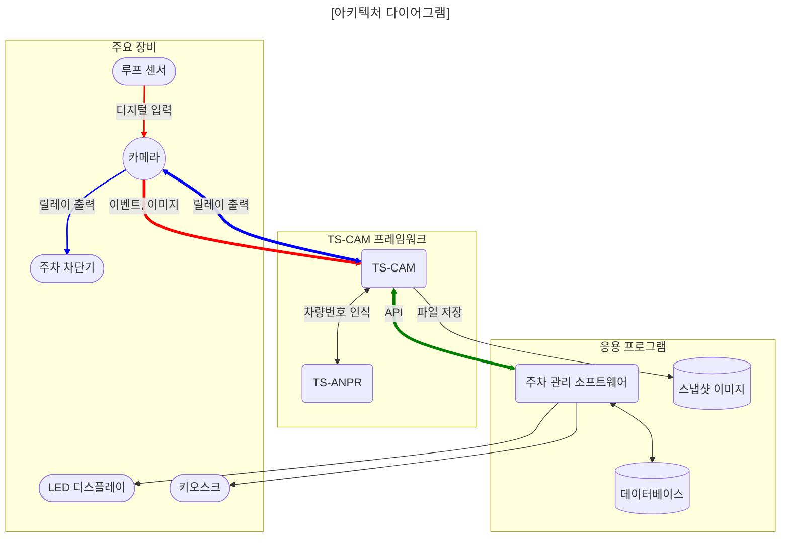

[English](../../README.md) | 한국어 | [日本語](../ja-JP/README.md) | [Tiếng Việt](../vi-VN/README.md)

# TS-CAM

TS-CAM은 ONVIF 호환 CCTV 카메라를 차량번호 인식에 활용할 수 있게 해주는 프레임워크입니다.

---

##### [😍 TS-ANPR 라이브 데모](http://tsnvr.ipdisk.co.kr/) <span style="font-size:.7em;font-weight:normal;color:grey">👈 여기서 차량번호 인식 성능을 테스트해보세요.</span>

##### 🚀 최신 버전 다운로드

- [TS-CAM](https://github.com/bobhyun/TS-CAM/releases/)
- [TS-ANPR](https://github.com/bobhyun/TS-ANPR/releases/)

##### 🎨 주요 프로그래밍 언어별 예제 코드

- [C#](../../examples/C%23/tscam-app) | [F#](../../examples/F%23/tscam-app) | [Java](../../examples/Java/tscam-app) | [JavaScript](../../examples/JavaScript/tscam-app) | [Kotlin](../../examples/Kotlin/tscam-app) | [Python](../../examples/Python/tscam-app) | [TypeScript](../../examples/TypeScript/tscam-app) | [VB.NET](../../examples/VB.NET/tscam-app)

##### 📖 응용 프로그램 개발 가이드

- [TS-CAM](../../DevGuide.md)
- [TS-ANPR](https://github.com/bobhyun/TS-ANPR/blob/main/DevGuide.md)

##### [🎁 설치 방법](Usage.md)

##### [⚖️ 라이선스](LICENSE.md)

_문의사항이나 요청사항이 있으시면 언제든 [Issues](https://github.com/bobhyun/TS-CAM/issues)를 열어주세요.
기꺼이 도와드리고 여러분의 피드백을 환영합니다!_

- 문의: 📧 skju3922@naver.com

---

## 목차

- [최신 버전 정보](#최신-버전-정보)
- [개요](#개요)
- [특징](#특징)

---

## 최신 버전 정보

#### Release v0.2.1 (2025.6.4)🎉

- `TS-CAM`이 `TS-ANPR`에서 분리되었습니다.
- 자체 서명된 인증서를 사용하는 HTTPS 카메라 지원
- TS-ANPR v3.0.0에서 추가된 `minChar`, `country` 및 `symbol` 지원

## 개요

루프 센서 입력, 스냅샷 이미지 획득, 차량번호 인식, 차단기 제어, 이미지 저장 기능이 모두 구현되어 있습니다.

카메라와 응용 프로그램 사이를 중재하는 서버(브로커) 역할을 하며, Socket.IO 기반의 경량 API를 통해 응용 프로그램과 실시간 메시지로 통신합니다.



## 특징

1. 소프트웨어 개발 생산성 향상
   응용 소프트웨어를 개발할 때 TS-CAM 프레임워크를 도입하면
   **카메라 인테페이스, 차량 번호 인식에 대한 세부사항들은 TS-CAM에 맏기고**
   응용 프로그램은 데이터베이스, 사용자 인터페이스와 같은 **비즈니스 로직에 집중**할 수 있어 개발 생산성이 향상될 수 있습니다.
2. 회복 탄력성
   시스템 서비스로 실행할 수 있기 때문에 소프트웨어 오류로 프로그램이 죽거나 시스템이 재부팅될 경우 자동으로 재실행되므로, **장애 상태로 방치되지 않고 스스로 복구되므로 안정성이 향상**됩니다.
3. 32비트 응용프로그램 성능 향상
   TS-CAM은 응용프로그램과 분리된 별도의 프로그램이기 떄문에 응용프로그램이 32비트라도 CPU와 운영체제가 64비트이면 **TS-CAM을 64비트로 실행**할 수 있습니다.
   이렇게 구성하면 기존 32비트 응용프로그램에서 **주로 CPU부하가 걸리는 부분을 64비트로 처리**하는 효과를 얻을 수 있습니다.
   멀티코어 CPU에서 32비트에 비해 64비트 차번인식 엔진이 **차번 인식속도가 약 2~4배 빠릅니다**.

   ```mermaid
   flowchart LR

   tscam<-->tsanpr(TS-ANPR)
   tscam(TS-CAM)<==>|API|app(응용프로그램)


   subgraph 32비트
   app
   end

   subgraph bit64Framework ["64비트"]
   tscam
   tsanpr
   end

   subgraph bit64OS ["64비트 운영체제"]
   bit64Framework
   32비트
   end

   classDef blue fill:#ccc,color:#fff,stroke:#333;
   class 32비트 blue

   linkStyle 1 stroke:green, stroke-width:4px;
   ```

4. 카메라 선택 폭이 넓어짐
   전용 카메라를 사용해야 하는 제약없이 CCTV 카메라 시장의 주류인 ONVIF 호환 카메라 중에서 **필요한 사양, 성능, 가격에 맞는 카메라를 직접 선정**할 수 있습니다.
