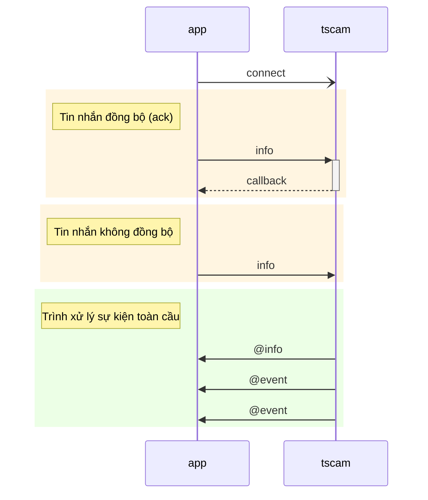

[English](../../DevGuide.md) | [한국어](../ko-KR/DevGuide.md) | [日本語](../ja-JP/DevGuide.md) | Tiếng Việt

# Hướng dẫn phát triển ứng dụng

## Mục lục
  - [Tổng quan](#tổng-quan)
  - [Tin nhắn](#tin-nhắn)
    - [1. `discover` Tìm kiếm camera](#1-discover-tìm-kiếm-camera)
    - [2. `info` Thông tin camera](#2-info-thông-tin-camera)
    - [3. `snapshot` Ảnh chụp](#3-snapshot-ảnh-chụp)
    - [4. `relayOutput` Đầu ra tiếp điểm](#4-relayoutput-đầu-ra-tiếp-điểm)
    - [5. `watchEvents` Chờ nhận sự kiện](#5-watchevents-chờ-nhận-sự-kiện)
    - [6. `unwatchEvents` Kết thúc nhận sự kiện](#6-unwatchevents-kết-thúc-nhận-sự-kiện)
    - [7. `watchList` Danh sách chờ nhận sự kiện](#7-watchlist-danh-sách-chờ-nhận-sự-kiện)
    - [8. `@event` Sự kiện](#8-event-sự-kiện)
  - [API nhận dạng biển số](#api-nhận-dạng-biển-số)
## Tổng quan

`TS-CAM` API sử dụng phương thức giao tiếp dựa trên Socket.IO để gửi tin nhắn thời gian thực.
API sử dụng `JSON` cho dữ liệu yêu cầu và phản hồi.
Khi sử dụng cách thức đồng bộ (`ack`), phản hồi cho yêu cầu được gọi thông qua hàm callback, do đó việc ghép cặp yêu cầu và phản hồi trở nên thuận tiện.

Trái lại, khi sử dụng cách thức không đồng bộ hoặc camera gửi sự kiện, ứng dụng nhận thông qua trình xử lý sự kiện toàn cầu. Trong trường hợp này, `@` ký tự được đặt trước tin nhắn để phân biệt tin nhắn ngược từ `TS-CAM` đến ứng dụng.



## Tin nhắn

#### 1. `discover` Tìm kiếm camera

Yêu cầu danh sách các camera tương thích ONVIF được kết nối với mạng nội bộ.

  - Tham số yêu cầu
    ```jsx
    {
      "timeout": 1500,        // Thời gian chờ camera phản hồi (mili giây)
      "device": "Ethernet"    // Thiết bị mạng (nếu bỏ qua sẽ sử dụng giá trị mặc định của hệ thống)
    }
    ```
    - Các tên thiết bị mạng có thể sử dụng cho `device` bao gồm:
        - Windows: `Ethernet` hoặc `Wi-Fi`
        - Linux: `eth0`, `enp0s3`, `wlan0`

  - Dữ liệu phản hồi
    - Nội dung dữ liệu phản hồi bao gồm thông tin cơ bản của mỗi camera có thể lấy được mà không cần đăng nhập, tùy theo nhà sản xuất có thể thiếu một số mục.
    - `href` là trường bắt buộc và được sử dụng làm khóa để tham chiếu đến camera trong các tin nhắn sau.
    ```jsx
    {
      "result": true,   // Kết quả xử lý
      "devices": [      // Danh sách camera được tìm thấy
        {
          "name": "DCC-1M0",
          "type": "NetworkVideoTransmitter",
          "hardware": "DCC-1M0",
          "Profile": [
            "Streaming"
          ],
          "href": "http://192.168.0.30/onvif/device_service"
        },
        {
          "name": "SNP-6320RH",
          "manufacturer": "Hanwha Techwin",          
          "type": "ptz",
          "hardware": "SNP-6320RH",
          "Profile": [
            "Streaming"
          ],
          "href": "http://192.168.0.195:8000/onvif/device_service"
        },
        {
          "name": "Dahua",
          "type": "Network_Video_Transmitter",
          "hardware": "IPC-HFW2231R-ZS-IRE6",
          "Profile": [
            "Streaming"
          ],
          "href": "http://192.168.0.203/onvif/device_service"
        },

        // ... bỏ qua
      ]
    }
    ```

#### 2. `info` Thông tin camera
Đăng nhập để lấy thông tin chi tiết của camera.
Trạng thái đăng nhập không được duy trì nên mỗi lần yêu cầu cần truyền `username` và `password`.

  - Tham số yêu cầu  
    ```jsx
    {
      "href": "http://192.168.0.30/onvif/device_service", // Camera đích
      "alias": "cổng vào bãi đỗ xe",  // Đặt tên
      "username": "admin",   // ID đăng nhập camera
      "password": "admin",   // Mật khẩu đăng nhập camera
      "authType": "basic"    // Phương thức xác thực
    }
    ```
      - `alias`: Đặt tên cho camera sẽ được thêm vào dữ liệu phản hồi.
      - `authType`: Chỉ định phương thức xác thực (`basic`, `digest`) được hỗ trợ bởi camera. Nếu bỏ qua, giá trị mặc định là `basic`.
  
  - Dữ liệu phản hồi
      - Nội dung mục `info` khác nhau tùy theo nhà sản xuất và thông số kỹ thuật camera.
      **[Quan trọng] Trong số này, `inputPorts` và `outputPorts` phải có ít nhất 1 mỗi để kết nối và sử dụng làm đầu vào cảm biến vòng lặp và đầu ra tiếp điểm điều khiển barie.**
    ```jsx
    {
      "href": "http://192.168.0.30/onvif/device_service",
      "alias": "cổng vào bãi đỗ xe",
      "result": true,         // Kết quả xử lý
      "info": {
        "manufacturer": "PARANTEK",
        "model": "DCC-1M0",
        "firmwareVersion": "PT_FW_0027",
        "serialNumber": "645C:F3:50:19FD",
        "hardwareId": "PT_HW_DCC_1M0",
        "inputPorts": 2,      // Số đầu vào
        "outputPorts": 1      // Số đầu ra
      }
    }
    ```

#### 3. `snapshot` Ảnh chụp
Yêu cầu ảnh chụp từ camera.
Khi tải ảnh chụp, hỗ trợ lưu trữ tệp ảnh, liên kết ảnh web và thực hiện nhận dạng biển số xe.

  - Tham số yêu cầu
    ```jsx
    {
      "href": "http://192.168.0.30/onvif/device_service", // Camera đích
      "alias": "cổng vào bãi đỗ xe",  // Đặt tên
      "username": "admin",   // ID đăng nhập camera
      "password": "admin",   // Mật khẩu đăng nhập camera
      "authType": "basic",   // Phương thức xác thực
      "anprOptions": "v"     // TS-ANPR tùy chọn nhận dạng biển số xe
    }
    ```
    - `alias`: Đặt tên cho camera sẽ được áp dụng cho tên tệp ảnh và tên thư mục lưu trữ.
      Đường dẫn lưu trữ ảnh được cấu trúc như sau:
      ```js
      ${TSCAM_DATA_DIR}/${YYYYMMDD}/${alias}/${alias}-${YYYYMMDD}-${hhmmss.SSS}_$lateNo}.jpg
      // ${TSCAM_DATA_DIR} thư mục được đặt trong biến môi trường
      // ${YYYYMMDD} ngày tháng năm 8 chữ số
      // ${alias} tên được chỉ định trong tham số yêu cầu
      // ${hhmmss.SSS} giờ phút giây.mili giây 10 chữ số
      // ${plateNo} biển số xe
      ```
    - `anprOptions`: Là các tùy chọn [options](https://github.com/bobhyun/TS-ANPR/blob/main/DevGuide.md#12-anpr_read_file) (`v,m,s,d,r`) được truyền cho động cơ nhận dạng biển số xe.
       Nếu muốn nhận dạng biển số mà không sử dụng ký tự tùy chọn, đặt `"anprOptions": ""`,
       Nếu không muốn sử dụng chức năng nhận dạng biển số, có thể bỏ qua mục `anprOptions`.
