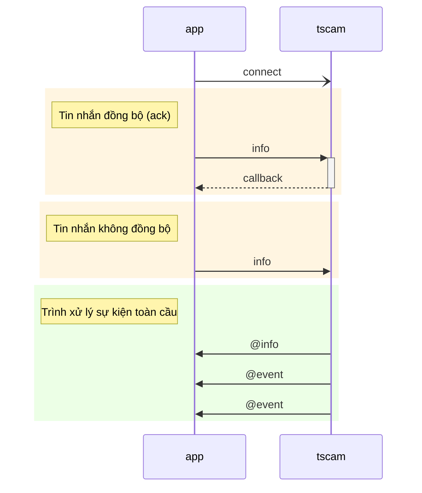
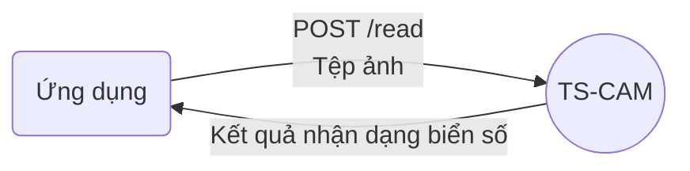

[English](../../DevGuide.md) | [한국어](../ko-KR/DevGuide.md) | [日本語](../ja-JP/DevGuide.md) | Tiếng Việt

# Hướng dẫn phát triển ứng dụng

## Mục lục
  - [Tổng quan](#tổng-quan)
  - [Tin nhắn](#tin-nhắn)
    - [1. `discover` Tìm kiếm camera](#1-discover-tìm-kiếm-camera)
    - [2. `info` Thông tin camera](#2-info-thông-tin-camera)
    - [3. `snapshot` Ảnh chụp](#3-snapshot-ảnh-chụp)
    - [4. `relayOutput` Đầu ra tiếp điểm](#4-relayoutput-đầu-ra-tiếp-điểm)
    - [5. `watchEvents` Chờ nhận sự kiện](#5-watchevents-chờ-nhận-sự-kiện)
    - [6. `unwatchEvents` Kết thúc nhận sự kiện](#6-unwatchevents-kết-thúc-nhận-sự-kiện)
    - [7. `watchList` Danh sách chờ nhận sự kiện](#7-watchlist-danh-sách-chờ-nhận-sự-kiện)
    - [8. `@event` Sự kiện](#8-event-sự-kiện)
  - [API nhận dạng biển số](#api-nhận-dạng-biển-số)

## Tổng quan

`TS-CAM` API sử dụng phương thức giao tiếp dựa trên Socket.IO để gửi tin nhắn thời gian thực.
API sử dụng `JSON` cho dữ liệu yêu cầu và phản hồi.
Khi sử dụng cách thức đồng bộ (`ack`), phản hồi cho yêu cầu được gọi thông qua hàm callback, do đó việc ghép cặp yêu cầu và phản hồi trở nên thuận tiện.

Trái lại, khi sử dụng cách thức không đồng bộ hoặc camera gửi sự kiện, ứng dụng nhận thông qua trình xử lý sự kiện toàn cầu. Trong trường hợp này, `@` ký tự được đặt trước tin nhắn để phân biệt tin nhắn ngược từ `TS-CAM` đến ứng dụng.



## Tin nhắn

#### 1. `discover` Tìm kiếm camera

Yêu cầu danh sách các camera tương thích ONVIF được kết nối với mạng nội bộ.

  - Tham số yêu cầu
    ```jsx
    {
      "timeout": 1500,        // Thời gian chờ camera phản hồi (mili giây)
      "device": "Ethernet"    // Thiết bị mạng (nếu bỏ qua sẽ sử dụng giá trị mặc định của hệ thống)
    }
    ```
    - Các tên thiết bị mạng có thể sử dụng cho `device` bao gồm:
        - Windows: `Ethernet` hoặc `Wi-Fi`
        - Linux: `eth0`, `enp0s3`, `wlan0`

  - Dữ liệu phản hồi
    - Nội dung dữ liệu phản hồi bao gồm thông tin cơ bản của mỗi camera có thể lấy được mà không cần đăng nhập, tùy theo nhà sản xuất có thể thiếu một số mục.
    - `href` là trường bắt buộc và được sử dụng làm khóa để tham chiếu đến camera trong các tin nhắn sau.
    ```jsx
    {
      "result": true,   // Kết quả xử lý
      "devices": [      // Danh sách camera được tìm thấy
        {
          "name": "DCC-1M0",
          "type": "NetworkVideoTransmitter",
          "hardware": "DCC-1M0",
          "Profile": [
            "Streaming"
          ],
          "href": "http://192.168.0.30/onvif/device_service"
        },
        {
          "name": "SNP-6320RH",
          "manufacturer": "Hanwha Techwin",          
          "type": "ptz",
          "hardware": "SNP-6320RH",
          "Profile": [
            "Streaming"
          ],
          "href": "http://192.168.0.195:8000/onvif/device_service"
        },
        {
          "name": "Dahua",
          "type": "Network_Video_Transmitter",
          "hardware": "IPC-HFW2231R-ZS-IRE6",
          "Profile": [
            "Streaming"
          ],
          "href": "http://192.168.0.203/onvif/device_service"
        },

        // ... bỏ qua
      ]
    }
    ```

#### 2. `info` Thông tin camera
Đăng nhập để lấy thông tin chi tiết của camera.
Trạng thái đăng nhập không được duy trì nên mỗi lần yêu cầu cần truyền `username` và `password`.

  - Tham số yêu cầu  
    ```jsx
    {
      "href": "http://192.168.0.30/onvif/device_service", // Camera đích
      "alias": "cổng vào bãi đỗ xe",  // Đặt tên
      "username": "admin",   // ID đăng nhập camera
      "password": "admin",   // Mật khẩu đăng nhập camera
      "authType": "basic"    // Phương thức xác thực
    }
    ```
      - `alias`: Đặt tên cho camera sẽ được thêm vào dữ liệu phản hồi.
      - `authType`: Chỉ định phương thức xác thực (`basic`, `digest`) được hỗ trợ bởi camera. Nếu bỏ qua, giá trị mặc định là `basic`.
  
  - Dữ liệu phản hồi
      - Nội dung mục `info` khác nhau tùy theo nhà sản xuất và thông số kỹ thuật camera.
      **[Quan trọng] Trong số này, `inputPorts` và `outputPorts` phải có ít nhất 1 mỗi để kết nối và sử dụng làm đầu vào cảm biến vòng lặp và đầu ra tiếp điểm điều khiển barie.**
    ```jsx
    {
      "href": "http://192.168.0.30/onvif/device_service",
      "alias": "cổng vào bãi đỗ xe",
      "result": true,         // Kết quả xử lý
      "info": {
        "manufacturer": "PARANTEK",
        "model": "DCC-1M0",
        "firmwareVersion": "PT_FW_0027",
        "serialNumber": "645C:F3:50:19FD",
        "hardwareId": "PT_HW_DCC_1M0",
        "inputPorts": 2,      // Số đầu vào
        "outputPorts": 1      // Số đầu ra
      }
    }
    ```

#### 3. `snapshot` Ảnh chụp
Yêu cầu ảnh chụp từ camera.
Khi tải ảnh chụp, hỗ trợ lưu trữ tệp ảnh, liên kết ảnh web và thực hiện nhận dạng biển số xe.

  - Tham số yêu cầu
    ```jsx
    {
      "href": "http://192.168.0.30/onvif/device_service", // Camera đích
      "alias": "cổng vào bãi đỗ xe",  // Đặt tên
      "username": "admin",   // ID đăng nhập camera
      "password": "admin",   // Mật khẩu đăng nhập camera
      "authType": "basic",   // Phương thức xác thực
      "anprOptions": "v"     // TS-ANPR tùy chọn nhận dạng biển số xe
    }
    ```
    - `alias`: Đặt tên cho camera sẽ được áp dụng cho tên tệp ảnh và tên thư mục lưu trữ.
      Đường dẫn lưu trữ ảnh được cấu trúc như sau:
      ```js
      ${TSCAM_DATA_DIR}/${YYYYMMDD}/${alias}/${alias}-${YYYYMMDD}-${hhmmss.SSS}_${plateNo}.jpg
      // ${TSCAM_DATA_DIR} thư mục được đặt trong biến môi trường
      // ${YYYYMMDD} ngày tháng năm 8 chữ số
      // ${alias} tên được chỉ định trong tham số yêu cầu
      // ${hhmmss.SSS} giờ phút giây.mili giây 10 chữ số
      // ${plateNo} biển số xe
      ```
    - `anprOptions`: Là các tùy chọn [options](https://github.com/bobhyun/TS-ANPR/blob/main/DevGuide.md#12-anpr_read_file) (`v,m,s,d,r`) được truyền cho động cơ nhận dạng biển số xe.
       Nếu muốn nhận dạng biển số mà không sử dụng ký tự tùy chọn, đặt `"anprOptions": ""`,
       Nếu không muốn sử dụng chức năng nhận dạng biển số, có thể bỏ qua mục `anprOptions`.

  - Dữ liệu phản hồi
    ```jsx
    {
      "href": "http://192.168.0.30/onvif/device_service",
      "alias": "cổng vào bãi đỗ xe",
      "result": true,
      "anpr": [       // Kết quả nhận dạng biển số khi sử dụng anprOptions
        {
          "area": {
            "angle": 0.927,
            "height": 51,
            "width": 216,
            "x": 1011,
            "y": 525
          },
          "attrs": {
            "ev": false
          },
          "conf": {
            "ocr": 0.958,
            "plate": 0.8966
          },
          "elapsed": 0.0545,
          "ev": false,
          "text": "51F-12345"
        }
      ],
      "image": {
        "filePath": "D:\\tmp\\tscam\\data\\20240812\\cổng vào bãi đỗ xe\\cổng vào bãi đỗ xe-20240812-113131.027_51F-12345.jpg", // Đường dẫn tệp đã lưu
        "uri": "http://127.0.0.1:10000/data/20240812/cổng vào bãi đỗ xe/cổng vào bãi đỗ xe-20240812-113131.027_51F-12345.jpg" // Liên kết ảnh
      }
    }
    ```

#### 4. `relayOutput` Đầu ra tiếp điểm
Điều khiển đầu ra tiếp điểm.
Đầu ra tiếp điểm thực hiện cho một camera tại một thời điểm, do đó không có giới hạn về giấy phép như số lượng camera tối đa.

```mermaid
---
title: "Điều khiển barie bãi đỗ xe bằng đầu ra tiếp điểm"
---
flowchart LR

loop1(Cảm biến vòng lặp #1)-->|Đầu vào số 0|cam1
cam1(Camera #1)-->tscam("TS-CAM<br/>(watchEvent)")
tscam==>|@event|app(Ứng dụng)
app-->|relayOutput|tscam
tscam-->|Đầu ra tiếp điểm 0|barrier(Barie)
```

  - Tham số yêu cầu
    ```jsx
    {
      "href": "http://192.168.0.30/onvif/device_service", // Camera đích
      "alias": "cổng vào bãi đỗ xe",  // Đặt tên
      "username": "admin",   // ID đăng nhập camera
      "password": "admin",   // Mật khẩu đăng nhập camera
      "authType": "basic",   // Phương thức xác thực
      "port": 0,            // Số cổng đầu ra tiếp điểm
      "value": 1            // Giá trị đầu ra (0: tắt, 1: bật)
    }
    ```

  - Dữ liệu phản hồi
    ```jsx
    {
      "href": "http://192.168.0.30/onvif/device_service",
      "alias": "cổng vào bãi đỗ xe",
      "result": true,
      "message": "Đã đặt giá trị đầu ra tiếp điểm cổng 0 thành 1."
    }
    ```

#### 5. `watchEvents` Chờ nhận sự kiện
Thiết lập để nhận sự kiện khi có đầu vào kích hoạt (đầu vào số) từ camera.
Chờ nhận sự kiện là tính năng có thể nhận sự kiện đồng thời từ nhiều camera như hình dưới đây.
Số lượng camera tối đa có thể giám sát đồng thời tuân theo giấy phép `TS-ANPR`.

```mermaid
---
title: "Nhận sự kiện từ nhiều camera"
---
flowchart LR

loop1(Cảm biến vòng lặp #1)-->|Đầu vào số 0|cam1(Camera #1)
loop2(Cảm biến vòng lặp #2)-->|Đầu vào số 0|cam2(Camera #2)
loop3(Cảm biến vòng lặp #3)-->|Đầu vào số 0|cam3(Camera #3)
loop4(Cảm biến vòng lặp #4)-->|Đầu vào số 1|cam3
cam1-->tscam("TS-CAM<br/>(watchEvents)")
cam2-->tscam
cam3-->tscam
tscam==>|@event|app(Ứng dụng)
```

  - Tham số yêu cầu
    Yêu cầu `watchEvents` sử dụng mảng để biểu diễn nhiều camera.
    ```jsx
    {
      "watchList": [
        {
          "href": "http://192.168.0.30/onvif/device_service", // Camera đích
          "alias": "cổng vào bãi đỗ xe",  // Đặt tên
          "username": "admin",   // ID đăng nhập camera
          "password": "admin",   // Mật khẩu đăng nhập camera
          "authType": "basic",   // Phương thức xác thực
          "anprOptions": "v",    // TS-ANPR tùy chọn nhận dạng biển số xe
          "snapshot": true       // Lấy ảnh chụp khi có sự kiện
        },
        {
          "href": "http://192.168.0.195:8000/onvif/device_service",
          "alias": "cổng ra bãi đỗ xe",
          "username": "admin",
          "password": "admin",
          "authType": "basic",
          "anprOptions": "v",
          "snapshot": true
        }
      ]
    }
    ```
    - `anprOptions`: Lấy ảnh chụp và thực hiện nhận dạng biển số xe khi có sự kiện.
    - `snapshot`: Lấy ảnh chụp khi có sự kiện.
    Nếu không đặt cả `anprOptions` và `snapshot`, chỉ nhận dữ liệu đầu vào sự kiện.

  - Dữ liệu phản hồi
    Dữ liệu phản hồi bao gồm phản hồi từ các camera đích trong `watchList` đang chờ nhận sự kiện. Nếu `result` là `true` cho mỗi camera, có nghĩa là đã được thiết lập thành công trạng thái chờ nhận sự kiện.
    ```jsx
    {
      "result": true,
      "watchList": [
        {
          "href": "http://192.168.0.30/onvif/device_service",
          "alias": "cổng vào bãi đỗ xe",
          "result": true, // Phản hồi camera
          "message": "Đã đăng ký nhận sự kiện thành công"
        },
        {
          "href": "http://192.168.0.195:8000/onvif/device_service",
          "alias": "cổng ra bãi đỗ xe",
          "result": true,
          "message": "Đã đăng ký nhận sự kiện thành công"
        }
      ]
    }
    ```

#### 6. `unwatchEvents` Kết thúc nhận sự kiện
Kết thúc chờ nhận sự kiện.

  - Tham số yêu cầu
    ```jsx
    {
      "watchList": [
        {
          "href": "http://192.168.0.30/onvif/device_service", // Camera đích
          "alias": "cổng vào bãi đỗ xe"  // Đặt tên
        },
        {
          "href": "http://192.168.0.195:8000/onvif/device_service",
          "alias": "cổng ra bãi đỗ xe"
        }
      ]
    }
    ```

  - Dữ liệu phản hồi
    ```jsx
    {
      "result": true,
      "watchList": [
        {
          "href": "http://192.168.0.30/onvif/device_service",
          "alias": "cổng vào bãi đỗ xe",
          "result": true,
          "message": "Đã kết thúc nhận sự kiện"
        },
        {
          "href": "http://192.168.0.195:8000/onvif/device_service",
          "alias": "cổng ra bãi đỗ xe",
          "result": true,
          "message": "Đã kết thúc nhận sự kiện"
        }
      ]
    }
    ```

#### 7. `watchList` Danh sách chờ nhận sự kiện
Yêu cầu `watchEvents`, `unwatchEvents` có thể thực hiện một lần hoặc chia thành nhiều lần.
Do đó, có thể cần kiểm tra danh sách camera hiện đang trong trạng thái chờ nhận sự kiện.

  - Tham số yêu cầu
    Không có

  - Dữ liệu phản hồi
    ```jsx
    {
      "result": true,
      "watchList": [
        {
          "href": "http://192.168.0.30/onvif/device_service",
          "alias": "cổng vào bãi đỗ xe",
          "anprOptions": "v",
          "snapshot": true
        },
        {
          "href": "http://192.168.0.195:8000/onvif/device_service",
          "alias": "cổng ra bãi đỗ xe",
          "anprOptions": "v",
          "snapshot": true
        }
      ]
    }
    ```

#### 8. `@event` Sự kiện
Khi có sự kiện xảy ra trên camera đang trong trạng thái chờ nhận sự kiện, sẽ nhận được `@event`.
Tùy theo tùy chọn `anprOptions`, `snapshot` được đặt trong yêu cầu `watchEvents`, sẽ bao gồm kết quả nhận dạng biển số xe và ảnh chụp.

  - Dữ liệu sự kiện
    ```jsx
    {
      "href": "http://192.168.0.30/onvif/device_service",
      "alias": "cổng vào bãi đỗ xe",
      "result": true,
      "event": {
        "source": {
          "simpleItem": [
            {
              "name": "InputToken",
              "value": "1"
            }
          ]
        },
        "data": {
          "simpleItem": [
            {
              "name": "LogicalState",
              "value": "1"
            }
          ]
        }
      },
      "image": {
        "filePath": "D:\\tmp\\tscam\\data\\20240812\\cổng vào bãi đỗ xe\\cổng vào bãi đỗ xe-20240812-142956.985_51F-12345.jpg",
        "uri": "http://127.0.0.1:10000/data/20240812/cổng vào bãi đỗ xe/cổng vào bãi đỗ xe-20240812-142956.985_51F-12345.jpg"
      },
      "anpr": [
        {
          "area": {
            "angle": 0.927,
            "height": 51,
            "width": 216,
            "x": 1011,
            "y": 525
          },
          "attrs": {
            "ev": false
          },
          "conf": {
            "ocr": 0.958,
            "plate": 0.8966
          },
          "elapsed": 0.0545,
          "ev": false,
          "text": "51F-12345"
        }
      ]
    }
    ```
    Để triển khai tính năng xác định biển số xe khách và mở barie bãi đỗ xe, khi nhận được tin nhắn `@event`, có thể truy vấn `anpr.text` trong cơ sở dữ liệu và gửi yêu cầu `relayOutput` để mở barie nếu phù hợp với điều kiện.

    Lưu ý rằng khi nhiều ứng dụng được kết nối với một `TS-ANPR`, khi có sự kiện xảy ra, tin nhắn `@event` được phát sóng đồng thời đến tất cả các ứng dụng.
    
    ```mermaid
    ---
    title: "Phát sóng sự kiện khi nhiều ứng dụng được kết nối"
    ---
    flowchart LR

    loop1(Cảm biến vòng lặp #1)-->|Đầu vào số 0|cam1
    cam1(Camera #1)-->tscam("TS-CAM<br/>(watchEvent)")
    tscam==>|@event|app1(Ứng dụng #1)
    tscam==>|@event|app2(Ứng dụng #2)
    tscam==>|@event|app3(Ứng dụng #3)
    tscam==>|@event|app4(Ứng dụng #4)
    app1-->|relayOutput|tscam
    app2-->|Phân tích ảnh|app2
    app3-->|Tải ảnh lên|storage[(Lưu trữ dung lượng lớn)]
    app4-->|API|Payment
    app1<-->db[(Cơ sở dữ liệu)]
    ```

    Sử dụng cấu trúc phát sóng sự kiện như vậy, có thể chia chức năng của mỗi ứng dụng thành kiến trúc vi dịch vụ như hình trên.

## API nhận dạng biển số
Để thuận tiện cho phát triển ứng dụng, cung cấp API nhận dạng biển số.
Như hình dưới đây, tải lên tệp ảnh lên máy chủ `TS-CAM` để nhận kết quả nhận dạng biển số.

Ảnh được tải lên máy chủ sẽ bị xóa khỏi bộ đệm bộ nhớ sau khi nhận dạng biển số và không được lưu trữ riêng.

- Điểm cuối: **POST /read**

- Tham số:
  - `options`: [Tùy chọn nhận dạng biển số (`vmsdr`)](https://github.com/bobhyun/TS-ANPR/blob/main/DevGuide.md#12-anpr_read_file)

- Nội dung yêu cầu:
  - `Content-Type: multipart/form-data`
  - `image`: Tệp ảnh cần phân tích (bắt buộc)

- Phản hồi:
  - `200 OK`: Thành công
    - Nội dung phản hồi:
      - `Content-Type: application/json`
      - [Kết quả nhận dạng biển số](https://github.com/bobhyun/TS-ANPR/blob/main/DevGuide.md#213-json) hoặc [Kết quả nhận dạng đối tượng](https://github.com/bobhyun/TS-ANPR/blob/main/DevGuide.md#222-json) theo `options` được chỉ định
  - `400 Bad Request`: Yêu cầu không hợp lệ
  - `500 Internal Server Error`: Lỗi máy chủ

- Ví dụ
  - Yêu cầu
    ```http
    POST http://127.0.0.1/read?options=v
    Content-Type: multipart/form-data; boundary=----WebKitFormBoundary7MA4YWxkTrZu0gW

    ------WebKitFormBoundary7MA4YWxkTrZu0gW
    Content-Disposition: form-data; name="image"; filename="car.jpg"
    Content-Type: image/jpeg

    (Dữ liệu nhị phân của tệp ảnh)
    ------WebKitFormBoundary7MA4YWxkTrZu0gW--
    ```
  - Phản hồi
    ```json
    HTTP/1.1 200 OK
    Content-Type: application/json

    [
      {
        "area": {
            "angle": 1.4943,
            "height": 63,
            "width": 200,
            "x": 1988,
            "y": 569
        },
        "attrs": {
            "ev": false
        },
        "conf": {
            "ocr": 0.9357,
            "plate": 0.8767
        },
        "elapsed": 0.0268,
        "ev": false,
        "text": "51F-12345"
      }
    ]
    ```
