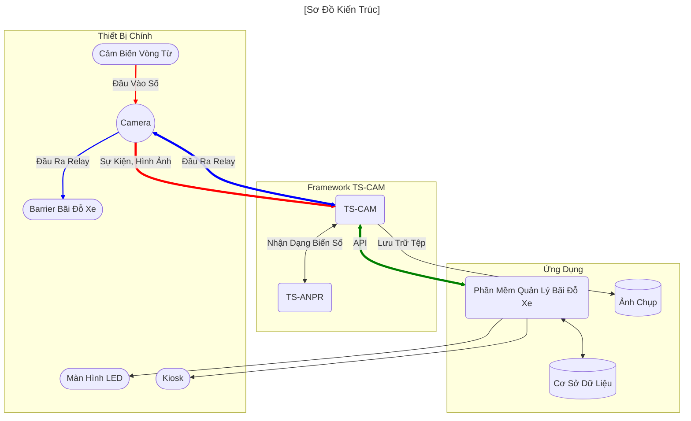

[English](../../README.md) | [한국어](../ko-KR/README.md) | [日本語](../ja-JP/README.md) | Tiếng Việt

# TS-CAM

TS-CAM là một framework cho phép sử dụng camera CCTV tương thích ONVIF để nhận dạng biển số xe.

---

##### [😍 TS-ANPR Demo Trực Tiếp](http://tsnvr.ipdisk.co.kr/) <span style="font-size:.7em;font-weight:normal;color:grey">👈 Kiểm tra hiệu suất nhận dạng biển số tại đây.</span>


##### 🚀 Tải Phiên Bản Mới Nhất

- [TS-CAM](https://github.com/bobhyun/TS-CAM/releases/)
- [TS-ANPR](https://github.com/bobhyun/TS-ANPR/releases/)

##### 🎨 Mã Nguồn Mẫu Bằng Các Ngôn Ngữ Phổ Biến

- [C#](../../examples/C%23/tscam-app) | [F#](../../examples/F%23/tscam-app) | [Java](../../examples/Java/tscam-app) | [JavaScript](../../examples/JavaScript/tscam-app) | [Kotlin](../../examples/Kotlin/tscam-app) | [Python](../../examples/Python/tscam-app) | [TypeScript](../../examples/TypeScript/tscam-app) | [VB.NET](../../examples/VB.NET/tscam-app)


##### 📖 Hướng Dẫn Phát Triển Ứng Dụng

- [TS-CAM](../../DevGuide.md)
- [TS-ANPR](https://github.com/bobhyun/TS-ANPR/blob/main/DevGuide.md)

##### [🎁 Cách Cài Đặt](Usage.md)

##### [⚖️ Giấy Phép](#LICENSE.md)

_Nếu bạn có bất kỳ câu hỏi hoặc yêu cầu nào, vui lòng tạo [Issues](https://github.com/bobhyun/TS-ANPR/issues).
Chúng tôi rất vui được hỗ trợ và chào đón phản hồi của bạn!_

- Liên hệ: 📧 skju3922@naver.com

---

## Mục Lục
- [Thông Tin Phiên Bản Mới Nhất](#thông-tin-phiên-bản-mới-nhất)
- [Tổng Quan](#tổng-quan)
- [Tính Năng](#tính-năng)

---

## Thông Tin Phiên Bản Mới Nhất

#### Release v0.2.1 (2025.6.4)🎉
   - `TS-CAM` đã được tách ra khỏi `TS-ANPR`.
   - Hỗ trợ camera HTTPS sử dụng chứng chỉ tự ký
   - Hỗ trợ `minChar`, `country` và `symbol` được thêm vào trong TS-ANPR v3.0.0

## Tổng Quan
Tất cả các chức năng đầu vào cảm biến vòng từ, chụp ảnh, nhận dạng biển số xe, điều khiển barrier và lưu trữ hình ảnh đều được triển khai.

Nó hoạt động như một máy chủ (broker) trung gian giữa camera và ứng dụng, và giao tiếp với ứng dụng thông qua API nhẹ dựa trên Socket.IO bằng tin nhắn thời gian thực.



## Tính Năng

1. Nâng cao năng suất phát triển phần mềm
   Khi phát triển phần mềm ứng dụng sử dụng framework TS-CAM,
   **Các chi tiết về giao diện camera và nhận dạng biển số xe được xử lý bởi TS-CAM**
   trong khi ứng dụng có thể tập trung vào **logic kinh doanh như cơ sở dữ liệu và giao diện người dùng**, giúp nâng cao năng suất phát triển.
2. Khả năng phục hồi
   Do có thể chạy dưới dạng dịch vụ hệ thống, khi phần mềm gặp lỗi hoặc hệ thống khởi động lại, nó sẽ tự động khởi động lại, do đó **không bị bỏ mặc trong trạng thái lỗi và tự phục hồi, cải thiện độ ổn định**.
3. Nâng cao hiệu suất ứng dụng 32-bit
   Vì TS-CAM là một chương trình riêng biệt với ứng dụng, ngay cả khi ứng dụng là 32-bit, TS-CAM có thể chạy ở 64-bit khi CPU và hệ điều hành là 64-bit.
   Cấu hình này cho phép ứng dụng 32-bit hiện tại **xử lý phần nặng về CPU bằng 64-bit**.
   Trên CPU đa lõi, động cơ nhận dạng biển số 64-bit chạy khoảng **2-4 lần nhanh hơn 32-bit**.

   ```mermaid
   flowchart LR

   tscam<-->tsanpr(TS-ANPR)
   tscam(TS-CAM)<==>|API|app(Ứng dụng)

   subgraph 32-bit
     app
   end

   subgraph bit64Framework ["64-bit"]
     tscam
     tsanpr
   end

   subgraph bit64OS ["Hệ điều hành 64-bit"]
     bit64Framework
     32-bit
   end

   classDef blue fill:#ccc,color:#fff,stroke:#333;
   class 32-bit blue

   linkStyle 1 stroke:green, stroke-width:4px;
   ```

4. Mở rộng lựa chọn camera
   Thay vì bị ràng buộc phải sử dụng camera chuyên dụng, bạn có thể chọn camera phù hợp với **các thông số kỹ thuật, hiệu suất và giá cả cần thiết** từ các camera tương thích ONVIF, là dòng chính trong thị trường camera CCTV.
